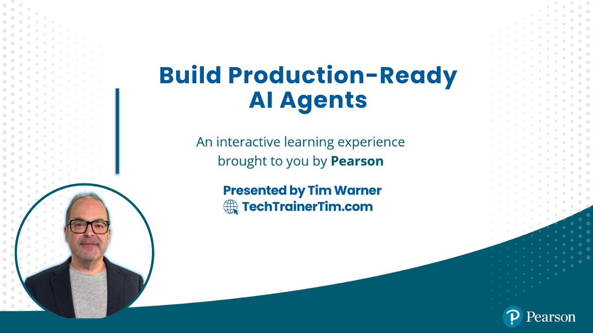

# Build Production-Ready AI Agents

<p align="center">
   
</p>

**O'Reilly Live Learning Course** | 4 Hours | LangGraph · CrewAI · MCP

[](https://techtrainertim.com)
[](https://www.linkedin.com/in/timothywarner/)
[](https://github.com/timothywarner-org)
[](https://learning.oreilly.com/search/?query=Tim%20Warner)

**Contact:** [Website](https://techtrainertim.com) · [LinkedIn](https://www.linkedin.com/in/timothywarner/) · [GitHub](https://github.com/timothywarner-org) · [O'Reilly](https://learning.oreilly.com/search/?query=Tim%20Warner)

---

## 🎯 Course Overview

A 4-hour hands-on workshop teaching you how to build, orchestrate, and deploy multi-agent AI systems using real production patterns. We'll explore existing agent tools, then build our own issue triage pipeline with PM, Dev, and QA agents working together.

**What You'll Learn:**
- What AI agents actually are (beyond the hype)
- How to use production agent tools (Copilot Studio, Claude Code)
- Building multi-agent systems with LangGraph and CrewAI
- Real-world orchestration patterns you can take to work Monday

### 🔧 Tech Stack Snapshot
- **LangGraph** — Orchestrates the PM→Dev→QA state machine that coordinates agent hand-offs.
- **CrewAI** — Provides the collaborative crew framework behind the PM, Dev, and QA personas.
- **FastMCP** — Exposes pipeline tools and data sources through a Model Context Protocol server.
- **Pydantic** — Validates structured issue inputs and pipeline outputs with strict models.
- **Rich** — Produces readable, structured logs for workshop demos and debugging.
- **SQLite** — Stores run history and analytics with a lightweight embedded database.
- **pytest** — Powers the automated regression suite learners can extend.

**What You'll Build:**
- A 3-agent issue triage system (PM → Dev → QA)
- GitHub integration for real issues
- Event-driven processing pipeline
- Your own agent playground to extend

---

## 📚 Course Flow (4 Hours)

### **Hour 1: Agent Fundamentals & Existing Tools** ⏱️ 0:00-1:00

**What are AI Agents, Really?**
- Definition: LLMs + Tools + Memory + Autonomy
- Agents vs. Chatbots vs. Assistants (clearing the confusion)
- When to use agents (and when NOT to)
- Real-world use cases that actually make sense

**Hands-On: Copilot Studio (20 minutes)**
- Creating a simple agent in Copilot Studio
- Adding skills and topics
- Testing conversational flow
- Publishing and monitoring

**Hands-On: Claude Code (20 minutes)**
- Setting up Claude for Desktop
- Writing prompts that work
- Using Model Context Protocol (MCP) for GitHub
- File operations, code generation, debugging

**Key Takeaway:** You don't need to build from scratch. Use existing tools when they fit.

---

### **Hour 2: Our Agent System - Architecture & Setup** ⏱️ 1:00-2:00

**The Big Picture**
- Demo: Watch the full pipeline run (GitHub issue → PM → Dev → QA → Output)
- Architecture walkthrough: Why 3 agents? Why these roles?
- LangGraph vs. CrewAI: When to use which framework

**Hands-On: Get It Running (30 minutes)**
- Clone the repo, run setup
- Configure your API keys (we'll use Anthropic or OpenAI)
- Run the interactive menu: `agent-menu`
- Process your first mock issue
- Inspect the output JSON

**Code Walkthrough: The Bones (15 minutes)**
- `models.py`: Data flowing through the system
- `config.py`: How we handle different LLM providers
- `pipeline/graph.py`: The agent orchestration (high-level only)

**Discussion: Decisions We Made**
- Why PM → Dev → QA? (Could it be different?)
- Why JSON files? (What else could we use?)
- Cost vs. quality trade-offs

**Key Takeaway:** Understand the flow before diving into code.

---

### **Hour 3: Agent Roles & Prompt Engineering** ⏱️ 2:00-3:00

**Deep Dive: The Three Agents**
- **PM Agent:** Translating vague requests into clear requirements
- **Dev Agent:** Code generation with practical constraints
- **QA Agent:** Review that actually catches problems

**Hands-On: Prompt Dissection (20 minutes)**
- Open `pipeline/prompts.py`
- Read the PM prompt together
- Identify: System prompt vs. user prompt
- Spot the output structure requirements
- See how context flows between agents

**Hands-On: Modify a Prompt (25 minutes)**
- Pick an agent (PM, Dev, or QA)
- Change the tone or focus (e.g., make QA stricter)
- Re-run the pipeline
- Compare outputs in `outgoing/`
- Discussion: What changed?

**Hands-On: GitHub Integration (15 minutes)**
- Set up your GitHub token
- Fetch a real issue from `timothywarner-org/agents2`
- Watch the agents process it
- See how real data is messier than mocks

**Key Takeaway:** Prompts are code. Small changes = big impacts.

---

### **Hour 4: Orchestration & Taking It Home** ⏱️ 3:00-4:00

**LangGraph Orchestration**
- State management: How data flows between agents
- Nodes vs. edges (it's just a graph!)
- Error handling: What happens when agents fail?
- Code walkthrough: `pipeline/graph.py` (the key parts)

**CrewAI Alternative**
- When would you use CrewAI instead?
- Agent collaboration patterns
- Code walkthrough: `pipeline/crew.py`

**Hands-On: Extension Ideas (30 minutes)**

*Pick ONE to try:*

1. **Add a 4th agent** (Design, Security, or Documentation)
   - Copy an existing agent
   - Write a simple prompt
   - Add to the graph
   - Test it

2. **Change the flow**
   - Make Dev and QA run in parallel
   - Add a "human approval" checkpoint
   - Loop QA back to Dev if rejected

3. **New input source**
   - Fetch issues from YOUR repo
   - Read from a CSV file
   - Connect to Jira or Linear

4. **Better outputs**
   - Generate markdown reports
   - Send Slack notifications
   - Create GitHub comments

**Production Considerations (10 minutes)**
- Cost tracking (how much does this cost per issue?)
- Observability (logs, traces, metrics)
- Rate limiting and retries
- Security (secrets, data privacy)
- Testing agent systems (it's harder than you think)

**Wrap-Up: What's Next?**
- Resources: LangGraph docs, CrewAI tutorials
- Community: Where to get help
- Your homework: Deploy this to production (we'll talk about how)

---

## 🚀 Quick Start (Before Class)

```bash
# 1. Clone the repo
git clone https://github.com/timothywarner-org/agents2.git
cd agents2/oreilly-agent-mvp

# 2. Run setup
./scripts/setup.sh      # Mac/Linux/Git Bash
.\scripts\setup.ps1     # Windows PowerShell

# 3. Configure .env
# Copy .env.example to .env
# Add your ANTHROPIC_API_KEY or OPENAI_API_KEY

# 4. Test it works
agent-menu
```

**Stuck?** Check [oreilly-agent-mvp/README.md](oreilly-agent-mvp/README.md) for detailed docs.

---

## 📂 Project Structure

```
agents2/
├── README.md                      # ← You are here (course outline)
└── oreilly-agent-mvp/            # ← The agent system
    ├── README.md                  # Technical documentation
    ├── src/agent_mvp/            # Source code
    │   ├── pipeline/             # Agent orchestration
    │   ├── cli/                  # Interactive menu
    │   ├── integrations/         # GitHub API
    │   └── watcher/              # Event-driven processing
    ├── mock_issues/              # Sample data for practice
    ├── scripts/                  # Helper scripts
    └── tests/                    # Unit tests
```

---

## 🎓 Prerequisites

**You Should Have:**
- Basic Python experience (if/else, functions, imports)
- Used an LLM before (ChatGPT, Claude, etc.)
- Comfortable with terminal/command line
- Git basics (clone, commit, push)

**You DON'T Need:**
- Deep Python expertise
- LangGraph or CrewAI experience
- Machine learning knowledge
- DevOps or cloud experience

**Required Tools:**
- Python 3.11+
- VS Code (recommended) or any editor
- Git
- API key from Anthropic OR OpenAI (free tier works)
- Optional: GitHub Personal Access Token (for real issue fetching)

---

## 💡 Learning Outcomes

By the end of this course, you'll be able to:

✅ **Explain** what AI agents are and when to use them
✅ **Use** Copilot Studio and Claude Code effectively
✅ **Build** a multi-agent system with clear roles
✅ **Orchestrate** agents using LangGraph or CrewAI
✅ **Write** effective prompts for agent personas
✅ **Integrate** real data sources (GitHub, files, etc.)
✅ **Deploy** event-driven agent workflows
✅ **Extend** the system for your own use cases

---

## 🔗 Resources

**Documentation:**
- [Full technical docs](oreilly-agent-mvp/README.md)
- [Azure deployment architecture](docs/azure-architecture.md)
- [LangGraph Documentation](https://langchain-ai.github.io/langgraph/)
- [CrewAI Documentation](https://docs.crewai.com/)

**Code Examples:**
- `oreilly-agent-mvp/mock_issues/` - Sample inputs
- `oreilly-agent-mvp/src/agent_mvp/pipeline/` - Agent code
- `oreilly-agent-mvp/outgoing/` - Sample outputs (after you run it)

**Community:**
- Course Slack: (link provided in class)
- GitHub Issues: [Report bugs or ask questions](https://github.com/timothywarner-org/agents2/issues)

---

## 🛠️ Troubleshooting

**"Setup failed" or "pip install errors"**
- Make sure Python 3.11+ is installed: `python --version`
- Try: `python -m pip install --upgrade pip`
- Still stuck? Use the Docker option (see technical docs)

**"API key not working"**
- Check for typos in `.env` file
- Anthropic keys start with `sk-ant-`
- OpenAI keys start with `sk-`
- Make sure there are no spaces or quotes around the key

**"Agent menu won't start"**
- Did you activate the virtual environment? `source .venv/Scripts/activate`
- Try: `python -m agent_mvp.cli.interactive_menu`

**See full troubleshooting guide:** [oreilly-agent-mvp/README.md#troubleshooting](oreilly-agent-mvp/README.md#troubleshooting)

---

## 📝 License & Usage

MIT License - Feel free to use this code in your own projects!

**Course Materials:** © 2026 Tim Warner / O'Reilly Media
**Code:** Open source, use freely

---

## 👨‍🏫 About the Instructor

**Tim Warner** teaches cloud, DevOps, and AI at O'Reilly, Pluralsight, and LinkedIn Learning.

- [TechTrainerTim.com](https://TechTrainerTim.com)
- [LinkedIn](https://linkedin.com/in/timothywarner)
- [GitHub](https://github.com/timothywarner-org)

---

**Ready to build some agents? Let's go! 🚀**
