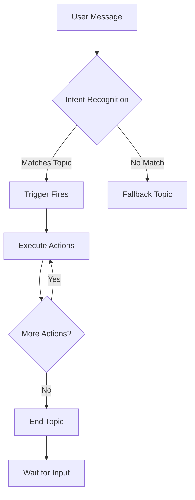
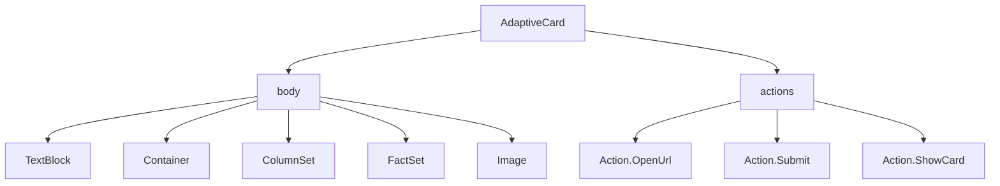
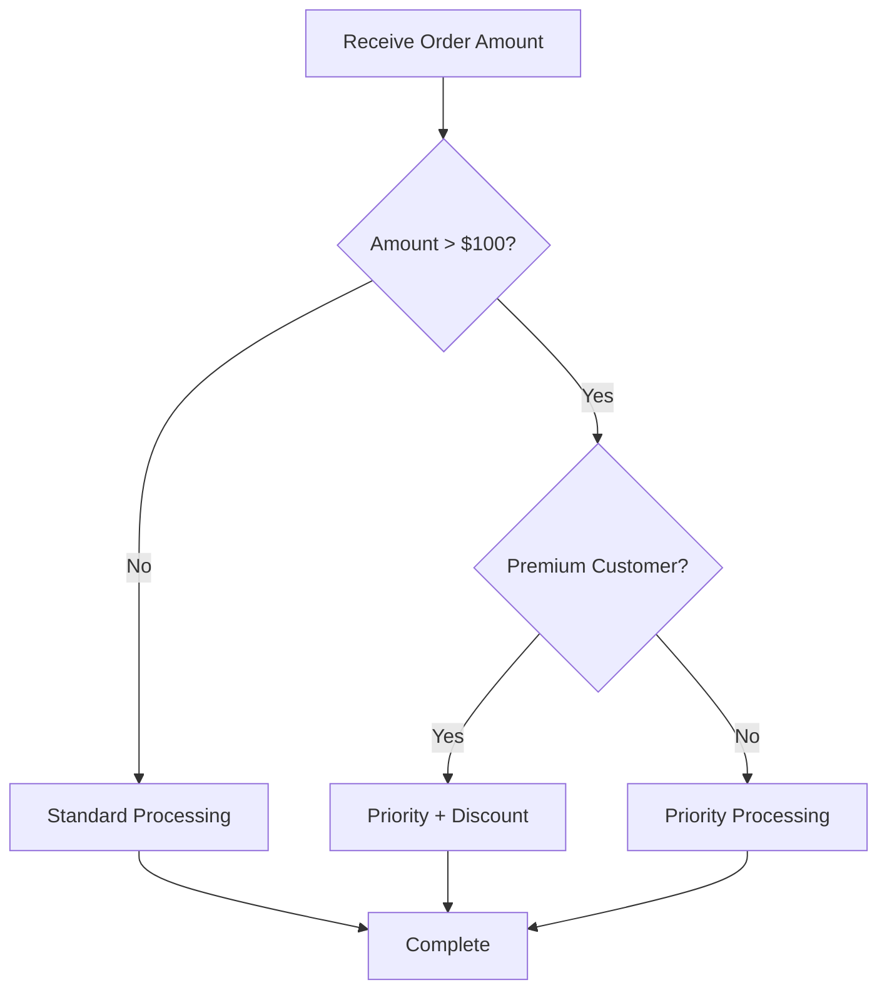

# Copilot Studio Topic Authoring Tutorial

This comprehensive tutorial covers how to author topics in Microsoft Copilot Studio using YAML-based Adaptive Dialogs. It includes best practices validated against official Microsoft documentation.

## Table of Contents

1. [Introduction to Topics](#introduction-to-topics)
2. [YAML File Structure](#yaml-file-structure)
3. [Trigger Configuration](#trigger-configuration)
4. [Action Nodes Reference](#action-nodes-reference)
5. [Variables and Scoping](#variables-and-scoping)
6. [Adaptive Cards](#adaptive-cards)
7. [Generative Answers](#generative-answers)
8. [Conditional Logic](#conditional-logic)
9. [Best Practices](#best-practices)
10. [MCP Integration Examples](#mcp-integration-examples)

---

## Introduction to Topics

Topics are the building blocks of conversations in Copilot Studio. Each topic represents a specific conversation flow that triggers based on user intent.

### Topic Architecture



### File Naming Convention

Topic files follow the pattern: `{topic-name}.topic.yaml`

**Important Rules:**
- Topic names must NOT contain periods (causes export failures)
- Use lowercase with hyphens for file names
- Keep names descriptive but concise

---

## YAML File Structure

Every Copilot Studio topic file follows this basic structure:

```yaml
# File header with metadata
kind: AdaptiveDialog
modelDescription: Brief description of what this topic does

beginDialog:
  kind: OnRecognizedIntent  # or OnUnknownIntent, OnEscalate
  id: main
  intent:
    displayName: Human-readable topic name
    triggerQueries:
      - "trigger phrase 1"
      - "trigger phrase 2"
      # Include 5-15 variations

  actions:
    - kind: SendActivity
      id: unique_action_id
      activity:
        text: Response message
    # ... more actions
```

### Required Elements

| Element | Purpose |
|---------|---------|
| `kind: AdaptiveDialog` | Declares this as an adaptive dialog topic |
| `beginDialog` | Contains trigger and action definitions |
| `id: main` | Entry point identifier |
| `actions` | List of actions to execute |

---

## Trigger Configuration

### OnRecognizedIntent

The most common trigger type. Fires when user input matches trigger phrases.

```yaml
beginDialog:
  kind: OnRecognizedIntent
  id: main
  intent:
    displayName: Order Status Check
    triggerQueries:
      - "Where is my order"
      - "Track my order"
      - "Order status"
      - "Check order status"
      - "When will my order arrive"
      - "Shipping status"
      - "Track package"
      - "Order tracking"
```

**Best Practice:** Include 5-15 trigger phrases with natural variations:
- Different phrasings of the same intent
- Questions and statements
- Formal and casual language
- Common typos (optional)

### OnUnknownIntent

Handles messages that don't match any topic.

```yaml
beginDialog:
  kind: OnUnknownIntent
  id: fallback
  actions:
    - kind: SendActivity
      id: sendActivity_fallback
      activity:
        text: I'm not sure I understand. Could you rephrase that?
```

### OnEscalate

Triggers when escalation is requested.

```yaml
beginDialog:
  kind: OnEscalate
  id: escalate
  conversationOutcome: Escalated
  actions:
    - kind: SendActivity
      id: sendActivity_escalate
      activity:
        text: Let me connect you with a human agent.
```

---

## Action Nodes Reference

### SendActivity

Sends a message to the user.

```yaml
- kind: SendActivity
  id: sendActivity_greeting_001
  activity:
    text: |
      Welcome to our support chat!
      How can I help you today?
```

**Properties:**
- `id`: Unique identifier (required)
- `activity.text`: Message content (supports markdown)
- `activity.attachments`: Rich content like Adaptive Cards

### Question

Collects user input and stores it in a variable.

```yaml
- kind: Question
  id: question_name_001
  alwaysPrompt: true
  variable: init:Topic.CustomerName
  prompt: What is your name?
  entity: PersonNamePrebuiltEntity
```

**Properties:**
- `variable`: Where to store the answer
- `prompt`: The question to ask
- `entity`: Entity type for validation
- `alwaysPrompt`: Whether to ask even if variable has value

### Built-in Entities

| Entity | Purpose |
|--------|---------|
| `PersonNamePrebuiltEntity` | Names |
| `StatePrebuiltEntity` | US states |
| `BooleanPrebuiltEntity` | Yes/No responses |
| `NumberPrebuiltEntity` | Numeric values |
| `DateTimePrebuiltEntity` | Dates and times |
| `EmailPrebuiltEntity` | Email addresses |

### Custom Entities

```yaml
entity:
  kind: EmbeddedEntity
  definition:
    kind: ClosedListEntity
    items:
      - id: option1
        displayName: First Option
      - id: option2
        displayName: Second Option
```

### ConditionGroup

Branches conversation based on conditions.

```yaml
- kind: ConditionGroup
  id: conditionGroup_check_001
  conditions:
    - id: condition_yes_001a
      condition: =Topic.UserResponse = true
      actions:
        - kind: SendActivity
          id: sendActivity_yes_002
          activity:
            text: Great! Let's proceed.

    - id: condition_no_001b
      condition: =Topic.UserResponse = false
      actions:
        - kind: SendActivity
          id: sendActivity_no_003
          activity:
            text: No problem. Let me know if you change your mind.

  elseActions:
    - kind: SendActivity
      id: sendActivity_else_004
      activity:
        text: I didn't quite catch that.
```

### BeginDialog

Calls another topic.

```yaml
- kind: BeginDialog
  id: beginDialog_sub_001
  dialog: another-topic-name
  input:
    SomeVariable: "{Topic.LocalValue}"
```

### EndDialog

Ends the current topic.

```yaml
- kind: EndDialog
  id: endDialog_success_001
```

---

## Variables and Scoping

### Variable Scopes

| Scope | Syntax | Persistence |
|-------|--------|-------------|
| Topic | `Topic.VarName` | Current topic only |
| Global | `Global.VarName` | Entire conversation |

### Initializing Variables

Use `init:` prefix to initialize only if not set:

```yaml
variable: init:Topic.Counter
```

### Using Variables in Text

```yaml
activity:
  text: "Hello, {Topic.CustomerName}! Your order {Global.OrderId} is being processed."
```

### Power Fx Expressions

Variables support Power Fx formulas:

```yaml
condition: =Topic.Amount > 100 && Topic.CustomerTier = "Premium"
```

---

## Adaptive Cards

Adaptive Cards provide rich, interactive UI elements.

### Basic Card Structure

```yaml
- kind: SendActivity
  id: sendActivity_card_001
  activity:
    attachments:
      - kind: AdaptiveCardTemplate
        cardContent: |
          {
            "type": "AdaptiveCard",
            "$schema": "http://adaptivecards.io/schemas/adaptive-card.json",
            "version": "1.5",
            "body": [
              {
                "type": "TextBlock",
                "text": "Card Title",
                "weight": "Bolder",
                "size": "Large"
              }
            ]
          }
```

### Card Elements Reference



### TextBlock

```json
{
  "type": "TextBlock",
  "text": "Your content here",
  "weight": "Bolder",
  "size": "Large",
  "color": "Accent",
  "wrap": true
}
```

### ColumnSet

```json
{
  "type": "ColumnSet",
  "columns": [
    {
      "type": "Column",
      "width": "stretch",
      "items": [
        {"type": "TextBlock", "text": "Left column"}
      ]
    },
    {
      "type": "Column",
      "width": "stretch",
      "items": [
        {"type": "TextBlock", "text": "Right column"}
      ]
    }
  ]
}
```

### FactSet

```json
{
  "type": "FactSet",
  "facts": [
    {"title": "Label 1", "value": "Value 1"},
    {"title": "Label 2", "value": "Value 2"}
  ]
}
```

### Actions

```json
{
  "actions": [
    {
      "type": "Action.OpenUrl",
      "title": "Learn More",
      "url": "https://example.com"
    },
    {
      "type": "Action.Submit",
      "title": "Confirm",
      "data": {"action": "confirm", "value": true}
    }
  ]
}
```

### Using Variables in Cards

```json
{
  "type": "TextBlock",
  "text": "Hello, ${Topic.CustomerName}!"
}
```

---

## Generative Answers

GenerativeAnswers nodes use AI to generate contextual responses from knowledge sources.

### Basic Configuration

```yaml
- kind: GenerativeAnswers
  id: generativeAnswers_help_001
  variable: Topic.AIResponse
  moderationLevel: High
  prompt: |
    Answer the user's question about {Topic.UserQuery}.
    Be concise and helpful.
    If you don't know the answer, say so clearly.
```

### Moderation Levels

| Level | Use Case |
|-------|----------|
| `High` | Public-facing agents, customer support |
| `Medium` | Internal tools, balanced safety |
| `Low` | Development, testing only |

**Best Practice:** Always use `High` for customer-facing topics.

### Knowledge Source Integration

GenerativeAnswers automatically searches configured knowledge sources:
- Website URLs
- Uploaded documents
- SharePoint sites
- Dataverse tables

### Prompt Engineering Tips

1. **Be Specific**: Tell the AI exactly what to do
2. **Provide Context**: Include relevant variables
3. **Set Boundaries**: Define what NOT to do
4. **Format Output**: Request specific response formats

```yaml
prompt: |
  You are a helpful support agent for {Global.CompanyName}.

  User question: {Topic.UserQuestion}
  User tier: {Topic.CustomerTier}

  Instructions:
  - Answer concisely in 2-3 sentences
  - Reference specific product features when relevant
  - If the question is about billing, redirect to the billing topic
  - Never share pricing information directly

  Respond in a friendly, professional tone.
```

---

## Conditional Logic

### Simple Conditions

```yaml
condition: =Topic.Value = "expected"
```

### Compound Conditions

```yaml
condition: =Topic.Amount > 100 && Topic.CustomerTier = "Premium"
```

```yaml
condition: =Topic.Status = "pending" || Topic.Status = "processing"
```

### Checking for Values

```yaml
condition: =!IsBlank(Topic.Email)
```

```yaml
condition: =Len(Topic.Input) > 0
```

### Decision Flow Example



Implemented in YAML:

```yaml
- kind: ConditionGroup
  id: conditionGroup_amount_001
  conditions:
    - id: condition_high_001a
      condition: =Topic.Amount > 100
      actions:
        - kind: ConditionGroup
          id: conditionGroup_tier_002
          conditions:
            - id: condition_premium_002a
              condition: =Topic.CustomerTier = "Premium"
              actions:
                - kind: SendActivity
                  id: sendActivity_priority_discount
                  activity:
                    text: "Priority processing with 10% discount applied!"
          elseActions:
            - kind: SendActivity
              id: sendActivity_priority
              activity:
                text: "Priority processing for your order."

  elseActions:
    - kind: SendActivity
      id: sendActivity_standard
      activity:
        text: "Standard processing for your order."
```

---

## Best Practices

### 1. Naming Conventions

- **Topic files**: `lowercase-with-hyphens.topic.yaml`
- **Action IDs**: `kind_purpose_sequence` (e.g., `sendActivity_greeting_001`)
- **Variables**: `PascalCase` (e.g., `Topic.CustomerName`)

### 2. Action ID Uniqueness

Every action must have a unique ID within the topic:

```yaml
# Good
- kind: SendActivity
  id: sendActivity_welcome_001

- kind: SendActivity
  id: sendActivity_confirm_002

# Bad - duplicate IDs
- kind: SendActivity
  id: sendActivity_001  # Duplicate!

- kind: SendActivity
  id: sendActivity_001  # Duplicate!
```

### 3. Trigger Phrase Guidelines

- Include 5-15 variations
- Mix questions and statements
- Use different vocabulary
- Consider regional language differences
- Avoid overly similar phrases (reduces accuracy)

### 4. Error Handling

Always provide fallback paths:

```yaml
- kind: ConditionGroup
  id: conditionGroup_validate_001
  conditions:
    - id: condition_valid_001a
      condition: =!IsBlank(Topic.UserInput)
      actions:
        # Process valid input

  elseActions:
    - kind: SendActivity
      id: sendActivity_retry
      activity:
        text: I didn't receive your response. Could you try again?
```

### 5. Moderation Settings

- Always set `moderationLevel: High` for GenerativeAnswers in production
- Test with lower moderation during development
- Document moderation choices in comments

---

## MCP Integration Examples

These examples show how to build Copilot Studio topics that guide users through MCP (Model Context Protocol) development.

### Example 1: MCP Tool Creation Guide

```yaml
kind: AdaptiveDialog
modelDescription: Helps users create MCP tools

beginDialog:
  kind: OnRecognizedIntent
  id: main
  intent:
    displayName: Create MCP Tool
    triggerQueries:
      - "How do I create an MCP tool"
      - "Add a tool to my MCP server"
      - "MCP tool example"
      - "Create tool for Claude"

  actions:
    - kind: Question
      id: question_language_001
      variable: init:Topic.Language
      prompt: Are you using Python or TypeScript?
      entity:
        kind: EmbeddedEntity
        definition:
          kind: ClosedListEntity
          items:
            - id: python
              displayName: Python
            - id: typescript
              displayName: TypeScript

    - kind: ConditionGroup
      id: conditionGroup_lang_001
      conditions:
        - id: condition_python_001a
          condition: =Topic.Language = "python"
          actions:
            - kind: SendActivity
              id: sendActivity_pythonTool_001
              activity:
                attachments:
                  - kind: AdaptiveCardTemplate
                    cardContent: |
                      {
                        "type": "AdaptiveCard",
                        "$schema": "http://adaptivecards.io/schemas/adaptive-card.json",
                        "version": "1.5",
                        "body": [
                          {
                            "type": "TextBlock",
                            "text": "Python MCP Tool Template",
                            "weight": "Bolder",
                            "size": "Large"
                          },
                          {
                            "type": "Container",
                            "style": "emphasis",
                            "items": [
                              {
                                "type": "TextBlock",
                                "text": "@mcp.tool()\nasync def my_tool(\n    param: str,\n    count: int = 10\n) -> str:\n    \"\"\"Tool description for the AI.\n    \n    Args:\n        param: What this parameter does\n        count: Optional count (default: 10)\n    \"\"\"\n    result = await process(param, count)\n    return json.dumps(result)",
                                "fontType": "Monospace",
                                "wrap": true
                              }
                            ]
                          },
                          {
                            "type": "TextBlock",
                            "text": "Key Points:",
                            "weight": "Bolder"
                          },
                          {
                            "type": "TextBlock",
                            "text": "- Use @mcp.tool() decorator\n- Always async functions\n- Docstring becomes tool description\n- Type hints define input schema\n- Return string or JSON",
                            "wrap": true
                          }
                        ],
                        "actions": [
                          {
                            "type": "Action.OpenUrl",
                            "title": "View Documentation",
                            "url": "https://modelcontextprotocol.io/sdk/python#tools"
                          }
                        ]
                      }
```

### Example 2: MCP Transport Selection Guide

```yaml
kind: AdaptiveDialog
modelDescription: Helps users choose the right MCP transport

beginDialog:
  kind: OnRecognizedIntent
  id: main
  intent:
    displayName: MCP Transport Selection
    triggerQueries:
      - "Which MCP transport should I use"
      - "stdio vs HTTP MCP"
      - "MCP transport options"

  actions:
    - kind: SendActivity
      id: sendActivity_intro_001
      activity:
        text: |
          MCP supports two transport protocols. Let me help you choose the right one.

    - kind: Question
      id: question_usecase_001
      variable: init:Topic.UseCase
      prompt: What's your primary use case?
      entity:
        kind: EmbeddedEntity
        definition:
          kind: ClosedListEntity
          items:
            - id: local
              displayName: Local development with Claude Desktop
            - id: vscode
              displayName: VS Code extension
            - id: web
              displayName: Web application
            - id: multiuser
              displayName: Multi-user production service

    - kind: ConditionGroup
      id: conditionGroup_transport_001
      conditions:
        - id: condition_local_001a
          condition: =Topic.UseCase = "local" || Topic.UseCase = "vscode"
          actions:
            - kind: SendActivity
              id: sendActivity_stdio_001
              activity:
                text: |
                  **Recommendation: stdio transport**

                  For local development and VS Code, stdio is the best choice:
                  - Simple setup (no server configuration)
                  - Direct process communication
                  - Automatic lifecycle management

        - id: condition_remote_001b
          condition: =Topic.UseCase = "web" || Topic.UseCase = "multiuser"
          actions:
            - kind: SendActivity
              id: sendActivity_http_001
              activity:
                text: |
                  **Recommendation: HTTP/SSE transport**

                  For web apps and multi-user services:
                  - Stateless scaling
                  - Standard web infrastructure
                  - Load balancer compatible
                  - Cloud deployment ready
```

---

## Validation Checklist

Before deploying your topic, verify:

- [ ] YAML syntax is valid (no tabs, proper indentation)
- [ ] Topic name has no periods
- [ ] All action IDs are unique
- [ ] Variables use correct scope (Topic vs Global)
- [ ] 5-15 trigger phrases included
- [ ] GenerativeAnswers has moderationLevel set
- [ ] Adaptive Card JSON is valid schema
- [ ] All conditions have else paths
- [ ] Error handling is in place

---

## Resources

- [Copilot Studio Documentation](https://learn.microsoft.com/microsoft-copilot-studio)
- [Adaptive Cards Designer](https://adaptivecards.io/designer)
- [Power Fx Reference](https://learn.microsoft.com/power-platform/power-fx/overview)
- [MCP Protocol Specification](https://modelcontextprotocol.io/specification)

---

*Last Updated: 2026-01-12*
*Version: 1.0.0*
