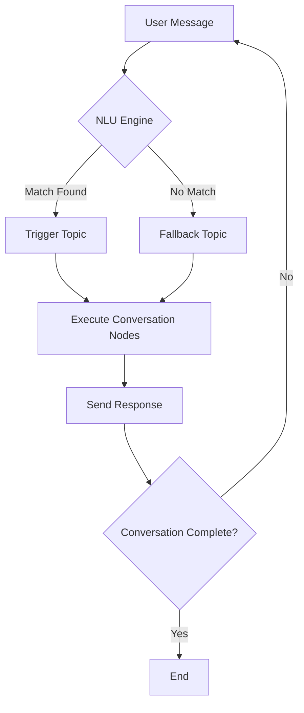
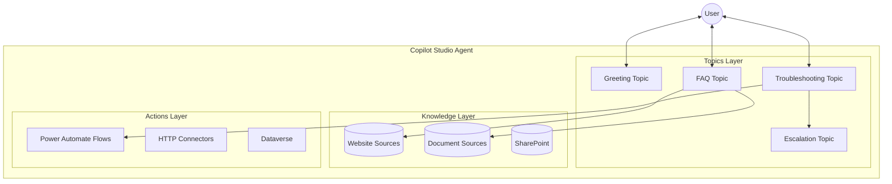
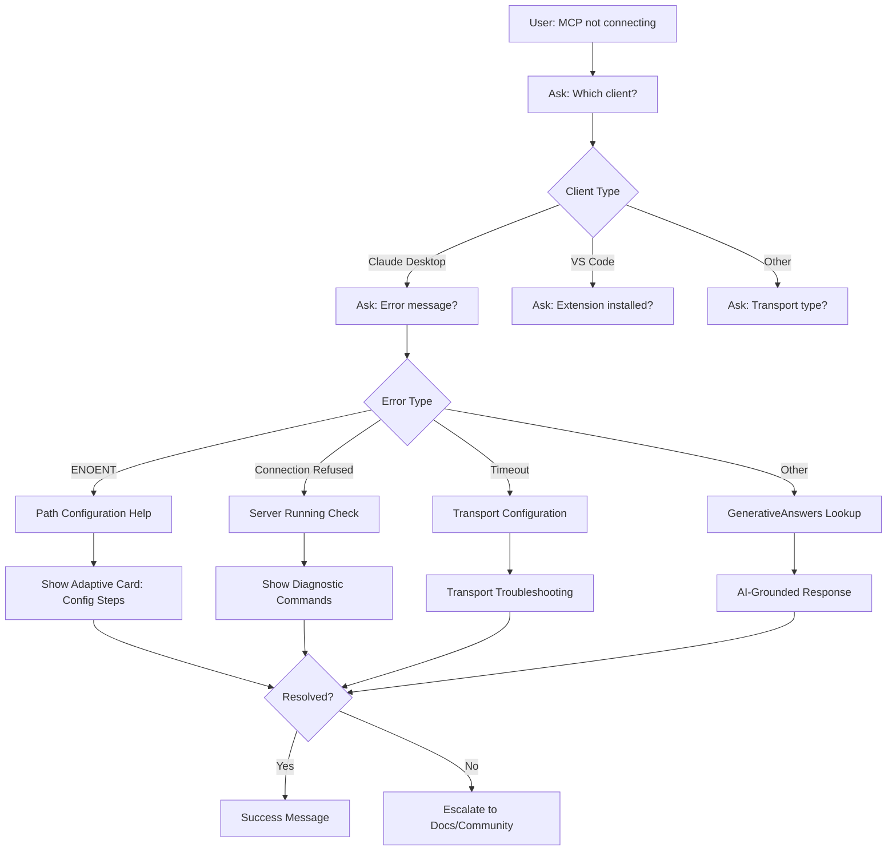
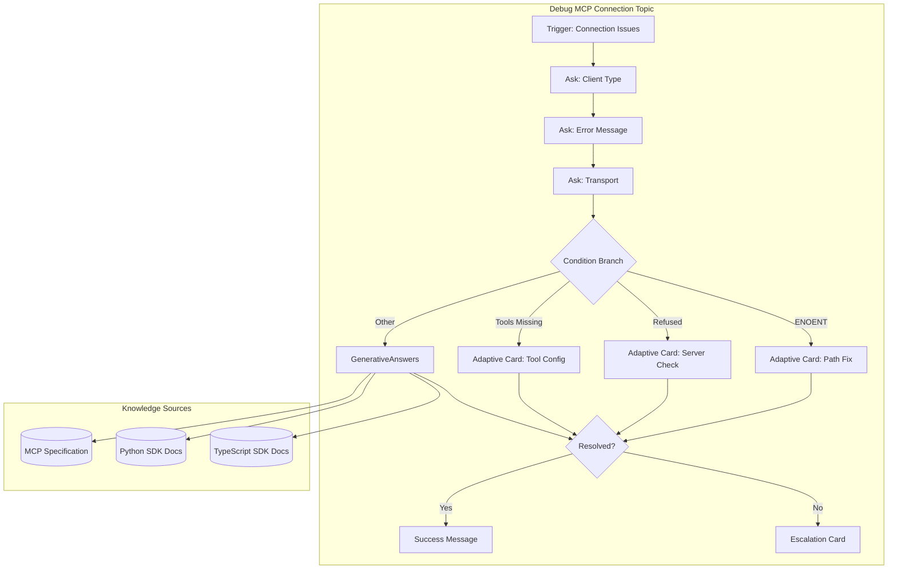

# Building Copilot Studio Topics: A Comprehensive Tutorial

This tutorial teaches you how to build custom topics for Microsoft Copilot Studio agents. By the end, you will understand how to create conversation flows using YAML, integrate AI-grounded responses, and build rich user experiences with Adaptive Cards.

**Target Audience:** Developers extending the MCP Expert Agent or building similar AI-powered assistants in Copilot Studio.

**Prerequisites:**
- Access to Microsoft Copilot Studio
- Basic understanding of YAML syntax
- Familiarity with conversational AI concepts

---

## Table of Contents

1. [Introduction to Copilot Studio Topics](#1-introduction-to-copilot-studio-topics)
2. [Building Your First Topic](#2-building-your-first-topic)
3. [Advanced Topic Features](#3-advanced-topic-features)
4. [MCP Expert Agent Use Case: Debug MCP Connection](#4-mcp-expert-agent-use-case-debug-mcp-connection)
5. [Best Practices](#5-best-practices)
6. [References](#6-references)

---

## 1. Introduction to Copilot Studio Topics

### What Are Topics?

Topics are the building blocks of conversation in Copilot Studio. Each topic represents a discrete conversation path that handles a specific user intent or scenario. Think of topics as "skills" your agent possesses - each one knows how to handle a particular type of request.

A topic consists of two main components:

| Component | Description |
|-----------|-------------|
| **Trigger Phrases** | Phrases, keywords, and questions that activate the topic |
| **Conversation Nodes** | Action steps that define what happens when the topic is triggered |

### How Topics Work

When a user sends a message, Copilot Studio's Natural Language Understanding (NLU) engine analyzes the input and matches it against all available topic triggers. The topic with the highest confidence score gets activated, and its conversation nodes execute sequentially.



### Topic Trigger Types

Copilot Studio supports multiple ways to trigger topics:

| Trigger Type | Use Case | Example |
|--------------|----------|---------|
| **OnRecognizedIntent** | User utterance matches trigger phrases | "How do I create an MCP tool?" |
| **OnUnknownIntent** | No topic matches the user's message | Fallback handling |
| **OnEscalate** | User requests human assistance | "Talk to a human" |
| **OnRedirect** | Called programmatically from another topic | Modular conversation flows |
| **OnEvent** | Custom events or system events | Inactivity timeout |

### Topic Architecture in a Copilot



---

## 2. Building Your First Topic

### YAML Structure Overview

Copilot Studio topics are defined using YAML in the code editor. Understanding the YAML structure is essential for building and maintaining topics efficiently.

Here is the basic skeleton of a topic YAML file:

```yaml
kind: AdaptiveDialog
beginDialog:
  kind: OnRecognizedIntent
  id: main
  intent:
    displayName: Topic Display Name
    triggerQueries:
      - "trigger phrase 1"
      - "trigger phrase 2"
      - "trigger phrase 3"

  actions:
    - kind: SendMessage
      id: action_001
      message: "Your response message here"
```

### Key YAML Elements Explained

| Element | Purpose | Required |
|---------|---------|----------|
| `kind: AdaptiveDialog` | Declares this as a topic definition | Yes |
| `beginDialog` | Contains the trigger configuration | Yes |
| `kind: OnRecognizedIntent` | Specifies intent-based triggering | Yes |
| `id` | Unique identifier for the trigger | Yes |
| `displayName` | Human-readable topic name | Yes |
| `triggerQueries` | Array of phrases that activate the topic | Yes |
| `actions` | Array of conversation nodes to execute | Yes |

### Creating Your First Topic: Hello MCP

Let us create a simple topic that greets users and introduces the MCP Expert Agent.

```yaml
kind: AdaptiveDialog
beginDialog:
  kind: OnRecognizedIntent
  id: main
  intent:
    displayName: Hello MCP Expert
    triggerQueries:
      - "hello"
      - "hi there"
      - "hey MCP expert"
      - "good morning"
      - "I need help with MCP"
      - "help me with model context protocol"
      - "MCP assistance"

  actions:
    # Step 1: Send a greeting message
    - kind: SendMessage
      id: sendGreeting_001
      message: |
        Hello! I'm the MCP Development Expert, your guide to building
        Model Context Protocol servers and clients.

        I can help you with:
        - Creating MCP tools, resources, and prompts
        - Setting up Python or TypeScript MCP servers
        - Debugging connection issues
        - Understanding transport protocols (stdio vs HTTP)

        What would you like to learn about today?
```

### Adding User Input with Question Nodes

To make your topic interactive, use Question nodes to collect user input:

```yaml
kind: AdaptiveDialog
beginDialog:
  kind: OnRecognizedIntent
  id: main
  intent:
    displayName: MCP Quickstart
    triggerQueries:
      - "get started with MCP"
      - "MCP quickstart"
      - "create my first MCP server"
      - "MCP hello world"
      - "start MCP development"

  actions:
    # Step 1: Welcome message
    - kind: SendMessage
      id: sendWelcome_001
      message: Great choice! Let's get you started with MCP development.

    # Step 2: Ask about preferred language
    - kind: Question
      id: askLanguage_001
      alwaysPrompt: true
      variable: init:Topic.PreferredLanguage
      prompt: Which programming language do you prefer?
      entity:
        kind: EmbeddedEntity
        definition:
          kind: ClosedListEntity
          items:
            - id: python
              displayName: Python
            - id: typescript
              displayName: TypeScript

    # Step 3: Respond based on selection
    - kind: ConditionGroup
      id: conditionLanguage_001
      conditions:
        - id: condPython_001
          condition: =Topic.PreferredLanguage = "python"
          actions:
            - kind: SendMessage
              id: sendPythonGuide_001
              message: |
                **Python MCP Setup**

                1. Install the MCP package:
                   ```
                   pip install mcp
                   ```

                2. Create your server file (server.py):
                   ```python
                   from mcp.server.fastmcp import FastMCP

                   mcp = FastMCP("My Server")

                   @mcp.tool()
                   async def hello(name: str) -> str:
                       """Greet someone by name."""
                       return f"Hello, {name}!"

                   if __name__ == "__main__":
                       mcp.run()
                   ```

                3. Run your server:
                   ```
                   python server.py
                   ```

        - id: condTypeScript_001
          condition: =Topic.PreferredLanguage = "typescript"
          actions:
            - kind: SendMessage
              id: sendTypeScriptGuide_001
              message: |
                **TypeScript MCP Setup**

                1. Install the MCP SDK:
                   ```
                   npm install @modelcontextprotocol/sdk
                   ```

                2. Create your server file (server.ts):
                   ```typescript
                   import { McpServer } from "@modelcontextprotocol/sdk/server/mcp.js";

                   const server = new McpServer({
                     name: "My Server",
                     version: "1.0.0"
                   });

                   server.tool("hello", { name: "string" },
                     async ({ name }) => `Hello, ${name}!`
                   );

                   server.run();
                   ```

                3. Run your server:
                   ```
                   npx ts-node server.ts
                   ```
```

### Understanding Variable Scopes

Variables in Copilot Studio have different scopes:

| Scope | Syntax | Lifetime | Use Case |
|-------|--------|----------|----------|
| **Topic** | `Topic.VarName` | Current topic only | Temporary data within a conversation flow |
| **Global** | `Global.VarName` | Entire session | Data shared across topics |
| **System** | `System.VarName` | Read-only system values | User info, channel, locale |

**Variable Initialization:**

Use `init:` prefix to initialize a variable when asking a question:

```yaml
- kind: Question
  id: askName_001
  variable: init:Topic.UserName  # Creates and stores in Topic.UserName
  prompt: What is your name?
  entity: PersonNamePrebuiltEntity
```

---

## 3. Advanced Topic Features

### 3.1 Adaptive Cards for Rich Responses

Adaptive Cards enable rich, interactive UI elements in your agent responses. They support layouts, images, buttons, and input forms.

#### Basic Adaptive Card Structure

```yaml
- kind: SendMessage
  id: sendCard_001
  message:
    - kind: AdaptiveCard
      cardContent: |
        {
          "$schema": "http://adaptivecards.io/schemas/adaptive-card.json",
          "type": "AdaptiveCard",
          "version": "1.5",
          "body": [
            {
              "type": "TextBlock",
              "text": "Card Title",
              "weight": "Bolder",
              "size": "Large"
            },
            {
              "type": "TextBlock",
              "text": "Card description goes here.",
              "wrap": true
            }
          ],
          "actions": [
            {
              "type": "Action.OpenUrl",
              "title": "Learn More",
              "url": "https://example.com"
            }
          ]
        }
```

#### MCP Tool Template Adaptive Card

Here is a practical example showing an MCP tool code template:

```yaml
- kind: SendMessage
  id: sendToolCard_001
  message:
    - kind: AdaptiveCard
      cardContent: |
        {
          "$schema": "http://adaptivecards.io/schemas/adaptive-card.json",
          "type": "AdaptiveCard",
          "version": "1.5",
          "body": [
            {
              "type": "TextBlock",
              "text": "MCP Tool Template",
              "weight": "Bolder",
              "size": "Large",
              "color": "Accent"
            },
            {
              "type": "TextBlock",
              "text": "Here's a ready-to-use tool structure for your MCP server:",
              "wrap": true
            },
            {
              "type": "Container",
              "style": "emphasis",
              "items": [
                {
                  "type": "TextBlock",
                  "text": "```python\n@mcp.tool()\nasync def my_tool(param: str) -> str:\n    \"\"\"Tool description here.\"\"\"\n    return f\"Result: {param}\"\n```",
                  "wrap": true,
                  "fontType": "Monospace"
                }
              ]
            },
            {
              "type": "FactSet",
              "facts": [
                { "title": "Decorator", "value": "@mcp.tool()" },
                { "title": "Async", "value": "Required for I/O operations" },
                { "title": "Docstring", "value": "Becomes tool description" },
                { "title": "Type hints", "value": "Define input schema" }
              ]
            }
          ],
          "actions": [
            {
              "type": "Action.OpenUrl",
              "title": "View Full Documentation",
              "url": "https://modelcontextprotocol.io/sdk/python#tools"
            },
            {
              "type": "Action.Submit",
              "title": "Show Resource Example",
              "data": {
                "action": "showResourceExample"
              }
            }
          ]
        }
```

#### Adaptive Card with User Input

Collect structured input using Adaptive Card forms:

```yaml
- kind: SendMessage
  id: sendInputCard_001
  message:
    - kind: AdaptiveCard
      cardContent: |
        {
          "type": "AdaptiveCard",
          "version": "1.5",
          "body": [
            {
              "type": "TextBlock",
              "text": "Configure Your MCP Server",
              "weight": "Bolder",
              "size": "Large"
            },
            {
              "type": "Input.Text",
              "id": "serverName",
              "label": "Server Name",
              "placeholder": "my-mcp-server"
            },
            {
              "type": "Input.ChoiceSet",
              "id": "transport",
              "label": "Transport Protocol",
              "choices": [
                { "title": "stdio (Local)", "value": "stdio" },
                { "title": "HTTP/SSE (Remote)", "value": "http" }
              ],
              "value": "stdio"
            },
            {
              "type": "Input.Toggle",
              "id": "includeExamples",
              "title": "Include example tools",
              "value": "true"
            }
          ],
          "actions": [
            {
              "type": "Action.Submit",
              "title": "Generate Server Code",
              "data": {
                "action": "generateServer"
              }
            }
          ]
        }
```

### 3.2 GenerativeAnswers for AI-Grounded Responses

The GenerativeAnswers node leverages AI to generate responses grounded in your knowledge sources. This is essential for providing accurate, up-to-date information without hard-coding responses.

#### Basic GenerativeAnswers Configuration

```yaml
- kind: GenerativeAnswers
  id: genAnswers_001
  variable: Topic.AIResponse
  prompt: |
    Answer the user's question about MCP development.
    Be concise and provide code examples when relevant.

    User question: {Topic.UserQuestion}
  moderationLevel: High
  useContentModeration: true
```

#### GenerativeAnswers with Knowledge Source Override

You can specify which knowledge sources the node should search:

```yaml
- kind: GenerativeAnswers
  id: genAnswers_mcpDocs_001
  variable: Topic.MCPAnswer
  prompt: |
    You are an MCP development expert. Using the official MCP documentation,
    answer the following question:

    {Topic.UserQuestion}

    Guidelines:
    - Provide working code examples
    - Mention relevant SDK methods
    - Include links to documentation sections
  moderationLevel: High
  knowledgeSources:
    - kind: WebsiteSource
      url: "https://modelcontextprotocol.io/specification"
    - kind: WebsiteSource
      url: "https://modelcontextprotocol.io/sdk/python"
    - kind: WebsiteSource
      url: "https://modelcontextprotocol.io/sdk/typescript"
```

#### Moderation Levels Explained

| Level | Behavior | Use Case |
|-------|----------|----------|
| **High** | Strict content filtering, conservative responses | Customer-facing agents |
| **Medium** | Balanced filtering | Internal tools |
| **Low** | Minimal filtering | Development/testing |

### 3.3 Conditional Branching and Logic

Use ConditionGroup nodes to create branching conversation flows:

```yaml
- kind: ConditionGroup
  id: conditionGroup_001
  conditions:
    # Condition 1: Python selected
    - id: cond_python
      condition: =Topic.Language = "python"
      actions:
        - kind: SendMessage
          id: msg_python
          message: Setting up Python MCP environment...

    # Condition 2: TypeScript selected
    - id: cond_typescript
      condition: =Topic.Language = "typescript"
      actions:
        - kind: SendMessage
          id: msg_typescript
          message: Setting up TypeScript MCP environment...

  # Default case (else)
  elseActions:
    - kind: SendMessage
      id: msg_default
      message: Please select either Python or TypeScript.
```

#### Complex Conditions with Power Fx

Copilot Studio uses Power Fx for condition expressions:

```yaml
# AND condition
condition: =Topic.Language = "python" && Topic.Experience = "beginner"

# OR condition
condition: =Topic.Transport = "stdio" || Topic.Transport = "http"

# NOT condition
condition: =!IsBlank(Topic.UserInput)

# Numeric comparison
condition: =Topic.ErrorCount > 3

# String contains
condition: =Contains(Topic.ErrorMessage, "connection refused")
```

### 3.4 Variables and Slot Filling

Slot filling automatically extracts entities from user input, reducing the number of questions needed.

```yaml
kind: AdaptiveDialog
beginDialog:
  kind: OnRecognizedIntent
  id: main
  intent:
    displayName: Create MCP Tool
    triggerQueries:
      - "create a tool called {Topic.ToolName}"
      - "add tool {Topic.ToolName} to my server"
      - "new MCP tool named {Topic.ToolName}"

  # Define slots to extract
  slots:
    - id: slot_toolName
      variable: Topic.ToolName
      entity: StringPrebuiltEntity
      prompt: What should the tool be called?

  actions:
    - kind: SendMessage
      id: confirmTool_001
      message: |
        Creating a tool named **{Topic.ToolName}**...

        Here's the template:
        ```python
        @mcp.tool()
        async def {Topic.ToolName}(param: str) -> str:
            """Description for {Topic.ToolName}."""
            return "result"
        ```
```

### 3.5 Calling Power Automate Flows

Integrate external systems and perform complex operations using Power Automate:

```yaml
- kind: InvokeFlow
  id: invokeFlow_001
  flow:
    flowId: "YOUR-FLOW-GUID-HERE"
    flowName: "Get MCP Server Status"
  inputs:
    - name: serverUrl
      value: =Topic.ServerUrl
    - name: transport
      value: =Topic.Transport
  outputs:
    - name: status
      variable: Topic.ServerStatus
    - name: tools
      variable: Topic.AvailableTools
    - name: errorMessage
      variable: Topic.ErrorMessage

- kind: ConditionGroup
  id: checkStatus_001
  conditions:
    - id: statusOK
      condition: =Topic.ServerStatus = "connected"
      actions:
        - kind: SendMessage
          id: msgConnected
          message: |
            Your MCP server is running!

            Available tools: {Topic.AvailableTools}
  elseActions:
    - kind: SendMessage
      id: msgError
      message: |
        Connection failed: {Topic.ErrorMessage}

        Would you like troubleshooting help?
```

### 3.6 Topic Redirection and Modularity

Break complex conversations into reusable topics:

```yaml
# Main topic redirecting to sub-topic
- kind: BeginDialog
  id: beginDialog_troubleshoot
  dialog: TroubleshootConnectionTopic
  inputs:
    - name: Transport
      value: =Topic.Transport
    - name: ErrorMessage
      value: =Topic.ErrorMessage
  outputs:
    - name: Resolution
      variable: Topic.Resolution
```

---

## 4. MCP Expert Agent Use Case: Debug MCP Connection

Now let us build a complete troubleshooting topic for the MCP Expert Agent. This topic guides users through diagnosing and fixing MCP connection issues.

### Conversation Flow Design



### Complete Topic YAML: Debug MCP Connection

```yaml
kind: AdaptiveDialog
beginDialog:
  kind: OnRecognizedIntent
  id: main
  intent:
    # IMPORTANT: No periods in topic names - causes export failures
    displayName: Debug MCP Connection
    triggerQueries:
      - "MCP server not connecting"
      - "Claude doesn't see my tools"
      - "MCP debugging"
      - "fix MCP connection"
      - "my MCP server won't start"
      - "connection refused MCP"
      - "ENOENT error MCP"
      - "MCP tools not showing"
      - "debug MCP"
      - "troubleshoot MCP server"
      - "MCP connection issues"
      - "server not responding MCP"

  actions:
    # Step 1: Acknowledge the issue
    - kind: SendMessage
      id: ackIssue_001
      message: |
        I'll help you debug your MCP connection. Let's diagnose the issue step by step.

    # Step 2: Ask which client they're using
    - kind: Question
      id: askClient_001
      alwaysPrompt: true
      variable: init:Topic.ClientType
      prompt: Which MCP client are you trying to connect to?
      entity:
        kind: EmbeddedEntity
        definition:
          kind: ClosedListEntity
          items:
            - id: claude_desktop
              displayName: Claude Desktop
            - id: vscode
              displayName: VS Code / Cursor
            - id: custom
              displayName: Custom Client

    # Step 3: Ask about the error message
    - kind: Question
      id: askError_001
      alwaysPrompt: true
      variable: init:Topic.ErrorMessage
      prompt: |
        What error message or behavior are you seeing?

        Common examples:
        - "ENOENT: no such file or directory"
        - "Connection refused"
        - "Tools not appearing in client"
        - "Server timeout"
      entity: StringPrebuiltEntity

    # Step 4: Ask about transport type
    - kind: Question
      id: askTransport_001
      alwaysPrompt: true
      variable: init:Topic.Transport
      prompt: Which transport protocol is your server using?
      entity:
        kind: EmbeddedEntity
        definition:
          kind: ClosedListEntity
          items:
            - id: stdio
              displayName: stdio (local process)
            - id: http
              displayName: HTTP/SSE (network)
            - id: unknown
              displayName: Not sure

    # Step 5: Branch based on error type
    - kind: ConditionGroup
      id: errorBranch_001
      conditions:
        # ENOENT Error - Path issues
        - id: cond_enoent
          condition: =Contains(Lower(Topic.ErrorMessage), "enoent") || Contains(Lower(Topic.ErrorMessage), "no such file")
          actions:
            - kind: SendMessage
              id: sendPathHelp_001
              message:
                - kind: AdaptiveCard
                  cardContent: |
                    {
                      "$schema": "http://adaptivecards.io/schemas/adaptive-card.json",
                      "type": "AdaptiveCard",
                      "version": "1.5",
                      "body": [
                        {
                          "type": "TextBlock",
                          "text": "ENOENT Error - Path Not Found",
                          "weight": "Bolder",
                          "size": "Large",
                          "color": "Warning"
                        },
                        {
                          "type": "TextBlock",
                          "text": "This error means the client cannot find your MCP server executable. Let's fix the configuration.",
                          "wrap": true
                        },
                        {
                          "type": "TextBlock",
                          "text": "Diagnostic Checklist",
                          "weight": "Bolder",
                          "spacing": "Medium"
                        },
                        {
                          "type": "FactSet",
                          "facts": [
                            { "title": "1. Verify path", "value": "Is the path in config absolute (not relative)?" },
                            { "title": "2. Check file", "value": "Does the server file actually exist?" },
                            { "title": "3. Permissions", "value": "Is the file executable?" },
                            { "title": "4. Python path", "value": "Is 'python' or 'python3' in your PATH?" }
                          ]
                        },
                        {
                          "type": "TextBlock",
                          "text": "Claude Desktop Config Location",
                          "weight": "Bolder",
                          "spacing": "Medium"
                        },
                        {
                          "type": "Container",
                          "style": "emphasis",
                          "items": [
                            {
                              "type": "TextBlock",
                              "text": "Windows: %APPDATA%\\Claude\\claude_desktop_config.json\nmacOS: ~/Library/Application Support/Claude/claude_desktop_config.json",
                              "wrap": true,
                              "fontType": "Monospace",
                              "size": "Small"
                            }
                          ]
                        },
                        {
                          "type": "TextBlock",
                          "text": "Example Configuration",
                          "weight": "Bolder",
                          "spacing": "Medium"
                        },
                        {
                          "type": "Container",
                          "style": "emphasis",
                          "items": [
                            {
                              "type": "TextBlock",
                              "text": "{\n  \"mcpServers\": {\n    \"my-server\": {\n      \"command\": \"python\",\n      \"args\": [\"C:/full/path/to/server.py\"]\n    }\n  }\n}",
                              "wrap": true,
                              "fontType": "Monospace",
                              "size": "Small"
                            }
                          ]
                        }
                      ],
                      "actions": [
                        {
                          "type": "Action.OpenUrl",
                          "title": "View Full Config Docs",
                          "url": "https://modelcontextprotocol.io/quickstart#claude-desktop"
                        }
                      ]
                    }

        # Connection Refused - Server not running
        - id: cond_refused
          condition: =Contains(Lower(Topic.ErrorMessage), "refused") || Contains(Lower(Topic.ErrorMessage), "not responding")
          actions:
            - kind: SendMessage
              id: sendServerCheck_001
              message:
                - kind: AdaptiveCard
                  cardContent: |
                    {
                      "$schema": "http://adaptivecards.io/schemas/adaptive-card.json",
                      "type": "AdaptiveCard",
                      "version": "1.5",
                      "body": [
                        {
                          "type": "TextBlock",
                          "text": "Connection Refused - Server Check",
                          "weight": "Bolder",
                          "size": "Large",
                          "color": "Warning"
                        },
                        {
                          "type": "TextBlock",
                          "text": "The client is trying to connect but no server is responding. Let's verify your server is running correctly.",
                          "wrap": true
                        },
                        {
                          "type": "TextBlock",
                          "text": "Step 1: Test Server Manually",
                          "weight": "Bolder",
                          "spacing": "Medium"
                        },
                        {
                          "type": "Container",
                          "style": "emphasis",
                          "items": [
                            {
                              "type": "TextBlock",
                              "text": "# Run your server directly\npython server.py\n\n# Check for startup errors\n# Server should print initialization messages",
                              "wrap": true,
                              "fontType": "Monospace",
                              "size": "Small"
                            }
                          ]
                        },
                        {
                          "type": "TextBlock",
                          "text": "Step 2: Check for Port Conflicts (HTTP only)",
                          "weight": "Bolder",
                          "spacing": "Medium"
                        },
                        {
                          "type": "Container",
                          "style": "emphasis",
                          "items": [
                            {
                              "type": "TextBlock",
                              "text": "# Windows\nnetstat -ano | findstr :8000\n\n# macOS/Linux\nlsof -i :8000",
                              "wrap": true,
                              "fontType": "Monospace",
                              "size": "Small"
                            }
                          ]
                        },
                        {
                          "type": "TextBlock",
                          "text": "Step 3: Add Debug Logging",
                          "weight": "Bolder",
                          "spacing": "Medium"
                        },
                        {
                          "type": "Container",
                          "style": "emphasis",
                          "items": [
                            {
                              "type": "TextBlock",
                              "text": "import logging\nlogging.basicConfig(level=logging.DEBUG)\n\n# This will show all MCP protocol messages",
                              "wrap": true,
                              "fontType": "Monospace",
                              "size": "Small"
                            }
                          ]
                        }
                      ],
                      "actions": [
                        {
                          "type": "Action.OpenUrl",
                          "title": "MCP Debugging Guide",
                          "url": "https://modelcontextprotocol.io/docs/debugging"
                        }
                      ]
                    }

        # Tools not appearing
        - id: cond_tools
          condition: =Contains(Lower(Topic.ErrorMessage), "tools not") || Contains(Lower(Topic.ErrorMessage), "not showing") || Contains(Lower(Topic.ErrorMessage), "not appearing")
          actions:
            - kind: SendMessage
              id: sendToolsHelp_001
              message:
                - kind: AdaptiveCard
                  cardContent: |
                    {
                      "$schema": "http://adaptivecards.io/schemas/adaptive-card.json",
                      "type": "AdaptiveCard",
                      "version": "1.5",
                      "body": [
                        {
                          "type": "TextBlock",
                          "text": "Tools Not Appearing in Client",
                          "weight": "Bolder",
                          "size": "Large",
                          "color": "Attention"
                        },
                        {
                          "type": "TextBlock",
                          "text": "If your server connects but tools don't appear, check these common issues:",
                          "wrap": true
                        },
                        {
                          "type": "FactSet",
                          "facts": [
                            { "title": "Missing decorator", "value": "Ensure @mcp.tool() is on each function" },
                            { "title": "No docstring", "value": "Tools need docstrings for descriptions" },
                            { "title": "Import errors", "value": "Check server logs for import failures" },
                            { "title": "Async required", "value": "Tool functions must be async" },
                            { "title": "Client restart", "value": "Try restarting Claude Desktop" }
                          ]
                        },
                        {
                          "type": "TextBlock",
                          "text": "Correct Tool Definition",
                          "weight": "Bolder",
                          "spacing": "Medium"
                        },
                        {
                          "type": "Container",
                          "style": "good",
                          "items": [
                            {
                              "type": "TextBlock",
                              "text": "@mcp.tool()\nasync def my_tool(param: str) -> str:\n    \"\"\"This docstring becomes the description.\"\"\"\n    return f\"Result: {param}\"",
                              "wrap": true,
                              "fontType": "Monospace",
                              "size": "Small"
                            }
                          ]
                        },
                        {
                          "type": "TextBlock",
                          "text": "Incorrect (Missing async/docstring)",
                          "weight": "Bolder",
                          "spacing": "Medium"
                        },
                        {
                          "type": "Container",
                          "style": "warning",
                          "items": [
                            {
                              "type": "TextBlock",
                              "text": "@mcp.tool()\ndef my_tool(param):  # Missing async, type hints, docstring\n    return param",
                              "wrap": true,
                              "fontType": "Monospace",
                              "size": "Small"
                            }
                          ]
                        }
                      ],
                      "actions": [
                        {
                          "type": "Action.OpenUrl",
                          "title": "Tool Documentation",
                          "url": "https://modelcontextprotocol.io/sdk/python#tools"
                        }
                      ]
                    }

      # Default case: Use GenerativeAnswers for unknown errors
      elseActions:
        - kind: SendMessage
          id: sendSearching_001
          message: Let me search the MCP documentation for information about this error...

        - kind: GenerativeAnswers
          id: genAnswers_debug_001
          variable: Topic.DebugAnswer
          prompt: |
            You are an MCP debugging expert. Help troubleshoot this connection issue:

            Client: {Topic.ClientType}
            Transport: {Topic.Transport}
            Error/Symptom: {Topic.ErrorMessage}

            Provide:
            1. Most likely cause
            2. Step-by-step fix
            3. Commands to verify the fix
            4. Link to relevant documentation

            Be concise and actionable.
          moderationLevel: High
          knowledgeSources:
            - kind: WebsiteSource
              url: "https://modelcontextprotocol.io"

    # Step 6: Ask if resolved
    - kind: Question
      id: askResolved_001
      alwaysPrompt: true
      variable: init:Topic.IsResolved
      prompt: Did this help resolve your connection issue?
      entity: BooleanPrebuiltEntity

    # Step 7: Handle resolution status
    - kind: ConditionGroup
      id: resolutionBranch_001
      conditions:
        - id: cond_resolved
          condition: =Topic.IsResolved = true
          actions:
            - kind: SendMessage
              id: sendSuccess_001
              message: |
                Excellent! Your MCP server should now be connected properly.

                **Quick tips for future debugging:**
                - Enable debug logging in your server
                - Check client logs (Claude Desktop: Developer Tools)
                - Test server standalone before connecting

                Is there anything else you'd like help with?

      elseActions:
        - kind: SendMessage
          id: sendEscalate_001
          message:
            - kind: AdaptiveCard
              cardContent: |
                {
                  "$schema": "http://adaptivecards.io/schemas/adaptive-card.json",
                  "type": "AdaptiveCard",
                  "version": "1.5",
                  "body": [
                    {
                      "type": "TextBlock",
                      "text": "Additional Resources",
                      "weight": "Bolder",
                      "size": "Large"
                    },
                    {
                      "type": "TextBlock",
                      "text": "If the issue persists, try these resources:",
                      "wrap": true
                    },
                    {
                      "type": "FactSet",
                      "facts": [
                        { "title": "GitHub Issues", "value": "Search or create an issue" },
                        { "title": "Discord", "value": "Ask the community" },
                        { "title": "Full Docs", "value": "Complete protocol reference" }
                      ]
                    }
                  ],
                  "actions": [
                    {
                      "type": "Action.OpenUrl",
                      "title": "MCP GitHub Issues",
                      "url": "https://github.com/modelcontextprotocol/specification/issues"
                    },
                    {
                      "type": "Action.OpenUrl",
                      "title": "MCP Documentation",
                      "url": "https://modelcontextprotocol.io"
                    },
                    {
                      "type": "Action.Submit",
                      "title": "Start Over with Different Details",
                      "data": {
                        "action": "restartDebug"
                      }
                    }
                  ]
                }
```

### Topic Architecture Diagram



---

## 5. Best Practices

### 5.1 Topic Naming Conventions

| Rule | Example | Reason |
|------|---------|--------|
| No periods in names | `Debug MCP Connection` not `Debug.MCP.Connection` | Periods cause export failures |
| Use descriptive names | `Create MCP Tool Python` | Clarity for maintenance |
| Prefix related topics | `MCP_Quickstart`, `MCP_Debugging` | Easy to find and organize |
| Avoid special characters | No `@`, `#`, `&` | YAML compatibility |

### 5.2 Trigger Phrase Guidelines

**Do:**
- Include 5-15 trigger phrases per topic
- Use varied sentence structures
- Include common misspellings
- Mix questions and statements
- Use natural language variations

**Don't:**
- Use identical phrases across topics (causes conflicts)
- Make phrases too short (single words match too broadly)
- Include punctuation in phrases
- Use technical jargon exclusively

**Example of Good Trigger Phrases:**

```yaml
triggerQueries:
  - "how do I create an MCP tool"
  - "create a tool for my server"
  - "add a new tool to MCP"
  - "MCP tool example"
  - "show me how to make a tool"
  - "tool creation in MCP"
  - "I want to add a tool"
  - "help me create a tool"
  - "tool definition MCP"
  - "what is the tool decorator"
```

### 5.3 Error Handling

Always plan for conversation failures:

```yaml
# Add a catch-all condition
- kind: ConditionGroup
  id: errorHandling_001
  conditions:
    - id: checkError
      condition: =!IsBlank(System.LastErrorMessage)
      actions:
        - kind: SendMessage
          id: errorMsg
          message: |
            I encountered an issue processing your request.

            Error: {System.LastErrorMessage}

            Let me try a different approach...

        - kind: BeginDialog
          id: fallback
          dialog: FallbackTopic
```

### 5.4 Testing Topics

**Manual Testing Checklist:**

| Test Case | What to Verify |
|-----------|----------------|
| Trigger recognition | Topic activates for all trigger phrases |
| Variable capture | User inputs stored correctly |
| Condition branches | All paths execute as expected |
| Adaptive Cards | Render correctly in target channel |
| GenerativeAnswers | Returns grounded, relevant responses |
| Edge cases | Empty input, unexpected values handled |

**Sample Test Conversation:**

```
User: My MCP server won't connect
Bot: I'll help you debug your MCP connection...
     Which MCP client are you trying to connect to?
User: Claude Desktop
Bot: What error message or behavior are you seeing?
User: ENOENT no such file or directory
Bot: [Shows Path Configuration Adaptive Card]
User: (Clicks action button or provides feedback)
```

### 5.5 Performance Optimization

| Practice | Benefit |
|----------|---------|
| Use specific knowledge sources in GenerativeAnswers | Faster, more accurate responses |
| Keep topics focused (single responsibility) | Easier to maintain and test |
| Use BeginDialog for reusable logic | Avoid duplication |
| Set appropriate moderationLevel | Balance quality vs response time |
| Limit Adaptive Card complexity | Faster rendering |

### 5.6 Security Considerations

```yaml
# Always validate external input
- kind: ConditionGroup
  id: validateInput_001
  conditions:
    - id: checkEmpty
      condition: =IsBlank(Topic.UserInput)
      actions:
        - kind: SendMessage
          id: promptAgain
          message: I didn't catch that. Could you please provide more details?

    - id: checkLength
      condition: =Len(Topic.UserInput) > 1000
      actions:
        - kind: SendMessage
          id: tooLong
          message: That input is quite long. Could you summarize the key points?
```

---

## 6. References

### Official Documentation

| Resource | URL |
|----------|-----|
| Copilot Studio Documentation | https://learn.microsoft.com/en-us/microsoft-copilot-studio/ |
| Topics Authoring | https://learn.microsoft.com/en-us/microsoft-copilot-studio/authoring-create-edit-topics |
| Generative Answers | https://learn.microsoft.com/en-us/microsoft-copilot-studio/nlu-boost-node |
| Adaptive Cards Designer | https://adaptivecards.io/designer/ |
| Power Fx Reference | https://learn.microsoft.com/en-us/power-platform/power-fx/overview |

### MCP Documentation

| Resource | URL |
|----------|-----|
| MCP Specification | https://modelcontextprotocol.io/specification |
| Python SDK | https://modelcontextprotocol.io/sdk/python |
| TypeScript SDK | https://modelcontextprotocol.io/sdk/typescript |
| Quickstart Guide | https://modelcontextprotocol.io/quickstart |

### Sample Repositories

| Resource | URL |
|----------|-----|
| Copilot Studio Samples | https://github.com/microsoft/copilotstudiosamples |
| Adaptive Cards Samples | https://adaptivecards.io/samples/ |

---

## Summary

This tutorial covered the essential concepts and techniques for building Copilot Studio topics:

1. **Topics are conversation building blocks** - Each handles a specific user intent with trigger phrases and action nodes.

2. **YAML structure is consistent** - AdaptiveDialog, triggers, and actions follow predictable patterns.

3. **Rich responses use Adaptive Cards** - JSON-based cards enable interactive UI elements.

4. **GenerativeAnswers provides AI grounding** - Connect to knowledge sources for dynamic, accurate responses.

5. **Conditions enable branching logic** - Power Fx expressions control conversation flow.

6. **Variables maintain state** - Topic and Global scopes for data persistence.

7. **Power Automate extends capabilities** - Call external services and perform complex operations.

8. **Best practices ensure quality** - Naming conventions, testing procedures, and error handling.

**Next Steps:**
- Import the Debug MCP Connection topic into your Copilot Studio agent
- Test with various error scenarios
- Extend with additional diagnostic flows
- Connect Power Automate for real-time server health checks

Happy building!
