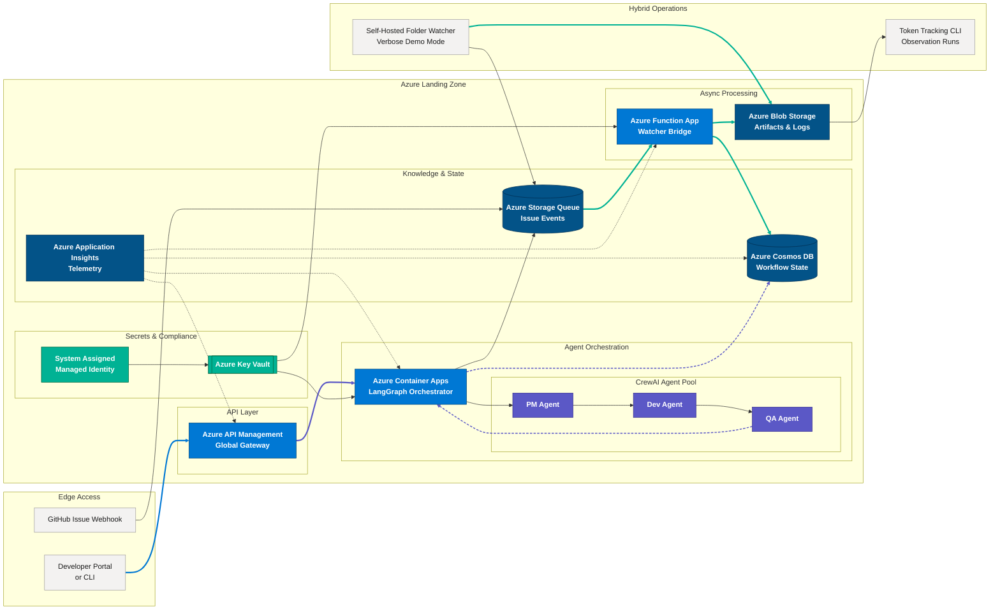

# Azure Architecture for O'Reilly Agent MVP

This diagram highlights the production-ready Azure landing zone that hosts the LangGraph + CrewAI pipeline alongside the folder watcher demo and token tracking utilities.

## Mermaid Diagram

## Exporting

1. Run `npx @mermaid-js/mermaid-cli -i docs/azure-architecture.md -o docs/azure-architecture.svg` to generate an SVG snapshot.
2. Attach the resulting asset to release notes or architectural reviews as needed.
