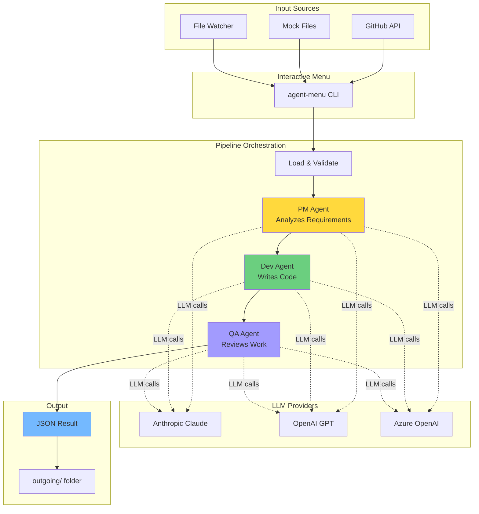

# Hour 2 Teaching Guide: Architecture & Setup

**Goal:** Students understand the system flow and get it running on their machines.

**Time:** 60 minutes

---

## 🎬 Opening (5 minutes)

**What We're Doing This Hour:**
1. Watch the full pipeline run (demo)
2. Understand WHY it's built this way
3. Get it running on YOUR machine
4. Look at the key files (not deep diving, just awareness)

**Key Message:** "You don't need to understand every line. We're building a mental model of how data flows."

---

## 🎥 Demo: The Full Pipeline (10 minutes)

### Setup Your Screen Share

```bash
cd agents2/oreilly-agent-mvp
agent-menu
```

### Demo Script

**Say:** "Let's watch this system process a real GitHub issue. I'm going to fetch issue #1 from our repo."

**Do:**
1. Select option `1` (Request an issue from GitHub)
2. Enter issue number: `1`
3. Choose `y` to process now
4. **PAUSE** while it runs—narrate what's happening:
   - "PM Agent is analyzing the issue..."
   - "Dev Agent is writing code..."
   - "QA Agent is reviewing..."

**Show the output:**
```bash
ls outgoing/
cat outgoing/result_YYYY-MM-DD_*.json | jq .
```

**Say:** "Three agents just collaborated to create this. Let's understand how."

---

## 🏗️ Architecture Walkthrough (15 minutes)

### The Big Picture Diagram



### Discussion Questions

**Ask:** "Why three agents? Why not just one big prompt?"

**Key Points to Make:**
- **Separation of concerns** (each agent has ONE job)
- **Easier to debug** (if QA is too harsh, fix QA only)
- **Cheaper** (run PM once, iterate on Dev/QA)
- **More realistic** (mimics real teams)

**Ask:** "What could go wrong with this design?"

**Key Points:**
- Agents can disagree
- Cost adds up (3 LLM calls per issue)
- Not all issues need 3 agents
- Linear flow can be slow

**Say:** "There's no perfect design. This is about trade-offs."

---

## 🛠️ Hands-On: Get It Running (30 minutes)

### Step 1: Setup Check (5 min)

**Have everyone run:**
```bash
cd agents2/oreilly-agent-mvp
python --version  # Should be 3.11+
ls .venv          # Should exist
```

**If anyone doesn't have `.venv`:**
```bash
./scripts/setup.sh      # Mac/Linux/Git Bash
.\scripts\setup.ps1     # Windows PowerShell
```

### Step 2: API Key Verification (5 min)

**Have everyone check their `.env`:**
```bash
cat .env | grep -E "ANTHROPIC|OPENAI"  # Should show their key
```

**Common issues:**
- Key has spaces: `ANTHROPIC_API_KEY = sk-ant-...` ❌
- Key is quoted: `ANTHROPIC_API_KEY="sk-ant-..."` ❌
- Correct: `ANTHROPIC_API_KEY=sk-ant-...` ✅

### Step 3: First Run (10 min)

**Everyone runs:**
```bash
agent-menu
# Select: 2 (Load a mock issue)
# Choose: 1 (issue_001.json)
# Process: y
```

**While it's running, explain:**
- "This is hitting the Anthropic or OpenAI API"
- "Each agent takes 10-30 seconds"
- "Cost: About $0.05-0.10 per issue"

**After it finishes:**
```bash
ls outgoing/
# Everyone should have a new result_*.json file
```

### Step 4: Inspect the Output (10 min)

**Have everyone open the newest file in `outgoing/`:**

**Point out the structure:**
```json
{
  "issue": { ... },           // What went IN
  "pm_output": { ... },       // PM's analysis
  "dev_output": { ... },      // Dev's code
  "qa_output": { ... },       // QA's review
  "metadata": { ... }         // Timestamps, costs
}
```

**Key observation:** "Notice how each agent builds on the previous one."

**Challenge:** "Find the QA verdict. Did the code pass?"

---

## 📁 Code Walkthrough: The Bones (15 minutes)

**Say:** "We're not reading every line. Just building awareness of where things are."

### File 1: `models.py` (Lines 1-100)

**Show in VS Code:**
```bash
code src/agent_mvp/models.py
```

**Scroll to these sections:**

**Lines 10-25:** Issue model
```python
class Issue(BaseModel):
    title: str
    description: str
    priority: str
    labels: List[str]
    source: str
```

**Say:** "This is our contract. Every issue must have these fields."

**Lines 40-60:** PMOutput model
```python
class PMOutput(BaseModel):
    summary: str
    acceptance_criteria: List[str]
    plan: List[str]
    assumptions: List[str]
```

**Say:** "This is what PM agent MUST return. It's not optional."

**Key Point:** "These models are the GLUE. They make sure agents speak the same language."

---

### File 2: `config.py` (Lines 1-80)

**Show in VS Code:**
```bash
code src/agent_mvp/config.py
```

**Lines 15-30:** Environment variables
```python
LLM_PROVIDER = os.getenv("LLM_PROVIDER", "anthropic")
ANTHROPIC_API_KEY = os.getenv("ANTHROPIC_API_KEY")
OPENAI_API_KEY = os.getenv("OPENAI_API_KEY")
```

**Say:** "This reads from your `.env` file. That's why we don't commit secrets."

**Lines 50-70:** get_llm() function
```python
def get_llm():
    if provider == "anthropic":
        return ChatAnthropic(model=model, temperature=temp)
    elif provider == "openai":
        return ChatOpenAI(model=model, temperature=temp)
```

**Say:** "This is how we support multiple LLM providers. ONE function, any provider."

**Key Point:** "Abstraction means we can swap Anthropic for OpenAI without touching agent code."

---

### File 3: `pipeline/graph.py` (Lines 300-330)

**Show in VS Code:**
```bash
code src/agent_mvp/pipeline/graph.py
```

**Lines 307-335:** Graph builder
```python
def create_pipeline_graph() -> StateGraph:
    builder = StateGraph(PipelineState)

    builder.add_node("load_issue", load_issue_node)
    builder.add_node("pm", pm_node)
    builder.add_node("dev", dev_node)
    builder.add_node("qa", qa_node)
    builder.add_node("finalize", finalize_node)

    builder.set_entry_point("load_issue")
    builder.add_edge("load_issue", "pm")
    builder.add_edge("pm", "dev")
    builder.add_edge("dev", "qa")
    builder.add_edge("qa", "finalize")
    builder.add_edge("finalize", END)

    return builder.compile()
```

**Say:** "This is LangGraph. It's just a flowchart in code."

**Draw on whiteboard/screen:**
```
load_issue → pm → dev → qa → finalize → END
```

**Say:** "Each arrow is an `add_edge`. Each box is an `add_node`. That's it."

**Key Point:** "We could change this to make dev and qa run in parallel. It's just changing edges."

---

## 🤔 Discussion: Design Decisions (5 minutes)

### Question 1: "Why PM → Dev → QA in that order?"

**Good answers:**
- Mimics real teams
- PM gives Dev clear requirements
- QA needs something to review

**Challenge them:** "Could QA come before Dev?"
- Maybe! QA could review the PLAN before code is written

### Question 2: "Why JSON files for input/output?"

**Good answers:**
- Easy to inspect
- Works without a database
- Good for demos and testing

**Challenge them:** "What would you use in production?"
- API endpoints
- Message queues (RabbitMQ, SQS)
- Database records

### Question 3: "Why support multiple LLM providers?"

**Good answers:**
- Cost flexibility
- Avoid vendor lock-in
- Different models for different tasks

**Real talk:** "Anthropic is great for coding. OpenAI has better function calling. Azure gives enterprise compliance."

---

## 🎯 Wrap-Up (5 minutes)

**What We Accomplished:**
- ✅ Watched the full pipeline run
- ✅ Understood why it's structured this way
- ✅ Got it running on your machine
- ✅ Saw the key files without drowning in code

**What's Next (Hour 3):**
- We'll open `prompts.py` and CHANGE things
- You'll modify agent behavior
- We'll fetch real GitHub issues

**Homework (Optional):**
- Run the pipeline on all 3 mock issues
- Compare the outputs
- Bonus: Try to break it (what happens if you give it garbage input?)

---

## 📝 Teaching Tips

### If Students Are Stuck on Setup

**Common Issue 1:** "pip install fails"
- Check Python version: `python --version`
- Try: `python -m pip install --upgrade pip`
- Last resort: Use PowerShell as admin

**Common Issue 2:** "agent-menu not found"
- Did they activate venv? `source .venv/Scripts/activate`
- Try direct: `python -m agent_mvp.cli.interactive_menu`

**Common Issue 3:** "API key invalid"
- Check for typos in `.env`
- No spaces, no quotes
- Verify key works: Test on Claude.ai or OpenAI web UI first

### If Students Are Ahead

**Challenge Tasks:**
1. "Read `pipeline/prompts.py` and predict what the PM will say"
2. "Find where the cost calculation happens" (Hint: metadata in output)
3. "Trace the code path: How does menu option 1 reach the PM agent?"

### Time Management

- If demo runs long: Skip mock issue walkthrough, just show the JSON
- If setup takes forever: Move code walkthrough to Hour 3
- If discussion is rich: Let it run, cut code walkthrough short

---

## 📚 Quick Reference: Files to Show

| File | Lines | What to Show |
|------|-------|--------------|
| `models.py` | 10-25 | Issue model structure |
| `models.py` | 40-60 | PMOutput model |
| `config.py` | 15-30 | Environment variables |
| `config.py` | 50-70 | LLM provider factory |
| `pipeline/graph.py` | 307-335 | Graph builder (the flow) |

**Pro Tip:** Have these files open in tabs BEFORE class starts.

---

**You got this! 🚀**
