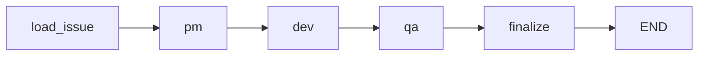

# Hour 4 Teaching Guide: Orchestration & Taking It Home

**Goal:** Students understand how agents are connected and extend the system themselves.

**Time:** 60 minutes

---

## 🎬 Opening (3 minutes)

**What We're Doing This Hour:**
1. Understand LangGraph orchestration (the glue)
2. See the CrewAI alternative (different approach)
3. YOU extend the system (add agent, change flow, or new feature)
4. Production considerations (how to ship this)

**Key Message:** "You now have a working agent system. Let's make it YOURS."

---

## 🕸️ LangGraph Orchestration (15 minutes)

### What is LangGraph?

**Say:** "LangGraph is a library for building stateful, multi-step workflows with LLMs."

**Key concepts:**
- **State:** Data that flows through the pipeline
- **Nodes:** Functions that transform state
- **Edges:** Connections between nodes
- **Graph:** The whole flow

**Draw on whiteboard:**
```
State: { issue, pm_output, dev_output, qa_output }
       ↓
    [PM Node] → updates state.pm_output
       ↓
    [Dev Node] → updates state.dev_output
       ↓
    [QA Node] → updates state.qa_output
       ↓
     [END]
```

---

### Code Walkthrough: The State

**Show:** `src/agent_mvp/pipeline/graph.py` (Lines 40-75)

```bash
code src/agent_mvp/pipeline/graph.py
```

**Read aloud (Lines 44-70):**
```python
class PipelineState(TypedDict, total=False):
    """State passed through the LangGraph pipeline."""

    # Run metadata
    run_id: str
    start_time: float
    source_file: Optional[str]

    # Pipeline data
    issue: Optional[dict]
    pm_output: Optional[dict]
    dev_output: Optional[dict]
    qa_output: Optional[dict]

    # Token tracking
    token_usages: list[dict]

    # Error handling
    error: Optional[str]

    # Final result cache
    result: Optional[dict]
```

**Say:** "This is the bucket that gets passed from agent to agent."

**Ask:** "What happens when PM finishes?"
- **Answer:** It adds `pm_output` to the state, then passes the whole state to Dev

**Key Point:** "Each agent reads the whole state, writes to its slice, and appends token usage for later cost reporting."

---

### Code Walkthrough: A Node Function

**Show:** `src/agent_mvp/pipeline/graph.py` (Lines 95-145)

**Read aloud (Lines 100-160):**
```python
def pm_node(state: PipelineState) -> PipelineState:
    logger = get_pipeline_logger()
    logger.node_enter("pm")

    if state.get("error"):
        return state

    try:
        config = get_config()
        llm = config.get_llm()
        issue = Issue(**state["issue"])
        prompt = format_pm_prompt(issue)

        logger.agent_message("pm", "Analyzing issue and creating plan...")
        response = llm.invoke([
            {"role": "system", "content": PM_SYSTEM_PROMPT},
            {"role": "user", "content": prompt},
        ])

        token_usage = extract_token_usage(response, config.llm_model)
        token_usages = state.get("token_usages", [])
        if token_usage:
            agent_tokens = AgentTokens(agent_name="PM", usage=token_usage)
            token_usages.append(agent_tokens.model_dump())

        pm_data = _extract_json(response.content)
        if pm_data is None:
            logger.warning("PM response was not valid JSON, using fallback")
            pm_data = {
                "summary": response.content[:500],
                "acceptance_criteria": ["Review PM response manually"],
                "plan": ["Parse PM output and refine"],
                "assumptions": ["LLM response format issue"],
            }

        pm_output = PMOutput(**pm_data)
        logger.agent_message("pm", f"Created {len(pm_output.plan)} plan steps")
        return {
            **state,
            "pm_output": pm_output.model_dump(),
            "token_usages": token_usages,
        }

    except Exception as e:
        return {**state, "error": f"PM agent failed: {e}"}
```

**Say:** "Let's break this down:"

**Lines 109-111:** Error checking
- If a previous agent failed, skip this one

**Lines 113-117:** Get the LLM
- Uses config we set in Hour 2

**Lines 118-120:** Parse and validate input
- Issue(**state["issue"]) ensures data is correct

**Lines 123-132:** Call the LLM
- This is the $$ moment—API call to Anthropic/OpenAI

**Lines 134-141:** Token tracking & fallback
- `extract_token_usage` stores usage for later cost reporting
- If the LLM forgets JSON, we fall back to a safe placeholder

**Lines 143-149:** Update state
- `{**state, "pm_output": ...}` adds PM's work to the bucket
- Token usage list travels with the state to finalize

**Key Point:** "Every node follows this pattern: Validate input → Call LLM → Validate output → Update state"

---

### Code Walkthrough: The Graph

**Show:** `src/agent_mvp/pipeline/graph.py` (Lines 307-335)

**Read aloud (Lines 312-330):**
```python
def create_pipeline_graph() -> StateGraph:
    """Create the LangGraph pipeline."""

    # Create the graph
    builder = StateGraph(PipelineState)

    # Add nodes
    builder.add_node("load_issue", load_issue_node)
    builder.add_node("pm", pm_node)
    builder.add_node("dev", dev_node)
    builder.add_node("qa", qa_node)
    builder.add_node("finalize", finalize_node)

    # Define edges (linear flow)
    builder.set_entry_point("load_issue")
    builder.add_edge("load_issue", "pm")
    builder.add_edge("pm", "dev")
    builder.add_edge("dev", "qa")
    builder.add_edge("qa", "finalize")
    builder.add_edge("finalize", END)

    # Compile
    return builder.compile()
```

**Say:** "This is the blueprint. Let's trace the flow:"

1. `set_entry_point("load_issue")` → Start here
2. `add_edge("load_issue", "pm")` → Then go to PM
3. `add_edge("pm", "dev")` → Then Dev
4. `add_edge("dev", "qa")` → Then QA
5. `add_edge("qa", "finalize")` → Then finalize
6. `add_edge("finalize", END)` → Done

**Draw as flowchart:**


**Ask:** "How would we make Dev and QA run in parallel?"
- **Answer:** Both would branch from PM, then merge at finalize

**Say:** "That's just changing edges. We'd keep the same nodes."

---

## 🤝 CrewAI Alternative (10 minutes)

### When to Use CrewAI Instead?

**Show:** `src/agent_mvp/pipeline/crew.py` (Lines 1-100)

```bash
code src/agent_mvp/pipeline/crew.py
```

**Say:** "CrewAI is higher-level. Less control, faster to build."

**Compare:**

| Feature | LangGraph | CrewAI |
|---------|-----------|--------|
| State management | Manual (you define it) | Automatic |
| Flow control | Explicit edges | Automatic delegation |
| Debugging | Easy (trace state) | Harder (black box) |
| Flexibility | Very high | Medium |
| Speed to build | Slower | Faster |

**Read aloud (Lines 48-64):**
```python
@classmethod
def create(cls, llm: Optional[LLM] = None) -> Agent:
    """Create the PM agent instance."""
    return Agent(
        role=cls.ROLE,
        goal=cls.GOAL,
        backstory=cls.BACKSTORY,
        llm=llm or _get_crew_llm(),
        verbose=True,
        allow_delegation=False,
    )
```

**Say:** "In CrewAI, agents are OBJECTS with roles, goals, backstories."

**Key differences:**
- LangGraph: "Run this function on this state"
- CrewAI: "You're a PM, here's your goal, figure it out"

**Ask:** "When would you choose CrewAI?"
- **Good answers:** Prototyping, when flow is obvious, when you want agents to self-organize

**Ask:** "When would you choose LangGraph?"
- **Good answers:** Production, complex flows, when you need full control

**Say:** "This project uses both to show you the trade-offs. In your work, pick ONE."

---

## 🔨 Hands-On: Extension Time (25 minutes)

### Setup (5 min)

**Say:** "Pick ONE extension to try. We have 20 minutes. Don't overthink it—just try."

**Option 1: Add a 4th Agent (Easy)**
- Example: Documentation Writer, Security Auditor, Performance Optimizer

**Option 2: Change the Flow (Medium)**
- Make Dev and QA run in parallel
- Add a "review loop" (QA can send back to Dev)
- Add a human approval step

**Option 3: New Input Source (Medium)**
- Fetch from YOUR GitHub repo
- Read from CSV file
- Add a REST API endpoint

**Option 4: Better Output (Easy)**
- Generate a markdown report
- Add cost tracking
- Create a summary email

**Have everyone commit to ONE choice and form pairs if needed.**

---

### Extension 1: Add a Documentation Agent

**Say:** "Let's add a 4th agent that writes documentation."

**Step 1: Create the agent class (Lines 250-280 in `crew.py`)**

```python
class DocAgent:
    """Documentation agent that writes user guides."""

    ROLE = "Technical Writer"
    GOAL = "Create clear, user-friendly documentation"
    BACKSTORY = """You are a Technical Writer who excels at making
    complex features easy to understand for end users."""

    @classmethod
    def create(cls, llm: Optional[LLM] = None) -> Agent:
        return Agent(
            role=cls.ROLE,
            goal=cls.GOAL,
            backstory=cls.BACKSTORY,
            llm=llm or _get_crew_llm(),
            verbose=True,
            allow_delegation=False,
        )
```

**Step 2: Add to graph (in `graph.py`)**

```python
# In create_pipeline_graph()
builder.add_node("doc", doc_node)
builder.add_edge("qa", "doc")  # After QA, before finalize
builder.add_edge("doc", "finalize")
```

**Step 3: Create the node function**

```python
def doc_node(state: PipelineState) -> PipelineState:
    """Doc agent writes user documentation."""
    # Similar structure to pm_node, dev_node, qa_node
    # Takes dev_output, generates docs
    # Returns {**state, "doc_output": doc_data}
```

**Step 4: Test it**

```bash
agent-menu
# Run a mock issue
# Check outgoing/ for doc_output field
```

---

### Extension 2: Parallel Dev and QA

**Say:** "Let's make Dev and QA run at the same time."

**Change the graph:**

**Before:**
```python
builder.add_edge("pm", "dev")
builder.add_edge("dev", "qa")
builder.add_edge("qa", "finalize")
```

**After:**
```python
# Both branch from PM
builder.add_edge("pm", "dev")
builder.add_edge("pm", "qa")

# Both lead to finalize
builder.add_edge("dev", "finalize")
builder.add_edge("qa", "finalize")
```

**Ask:** "What's the problem with this?"
- QA needs Dev's code to review!

**Solution:** Add a conditional edge
```python
def should_run_qa(state):
    # Only run QA if Dev is done
    return "qa" if "dev_output" in state else "finalize"

builder.add_conditional_edges("pm", should_run_qa)
```

**Say:** "This is why orchestration is hard. Dependencies matter."

---

### Extension 3: Surface Token Costs

**Say:** "Token tracking already runs automatically—let's surface it in a new way."

**Step 1: Inspect the utilities**

```bash
code src/agent_mvp/util/token_tracking.py
```

**Point out:** `aggregate_pipeline_tokens` combines per-agent usage, and `format_token_summary` prints a nice table (called from `finalize_node`).

**Step 2: Customize the summary**

```python
def format_token_summary(pipeline_tokens: PipelineTokens) -> str:
    lines = ["Token Usage Summary"]
    for agent in pipeline_tokens.agents:
        cost = agent.usage.estimated_cost_usd or 0.0
        lines.append(f"- {agent.agent_name}: {agent.usage.total_tokens} tokens (${cost:.4f})")
    lines.append(f"Total: {pipeline_tokens.total_tokens} tokens (${pipeline_tokens.estimated_total_cost_usd:.4f})")
    return "\n".join(lines)
```

**Step 3: Persist it somewhere**

```python
# In finalize_node, after PipelineResult.create(...)
result = PipelineResult.create(...)
result.next_steps.insert(0, format_token_summary(pipeline_tokens))
```

**Show the output:**
```bash
cat outgoing/result_*.json | jq .metadata.token_usage
# Includes per-agent tokens, totals, and estimated cost
```

---

### Show and Tell (5 min)

**Say:** "Who wants to demo what they built?"

**Pick 2-3 volunteers to share:**
- What extension did you try?
- What worked?
- What broke?
- What would you do differently?

**Key Point:** "Breaking stuff is learning. That's why we have mock issues."

---

## 🏭 Production Considerations (10 minutes)

### Cost Management

**Say:** "At scale, costs add up FAST."

**Calculations:**
- 1 issue = 3 agents × $0.015 = ~$0.05
- 100 issues/day = $5/day = $150/month
- 1000 issues/day = $1500/month

**Optimization strategies:**
1. **Use cheaper models for simple tasks** (Haiku for PM, Sonnet for Dev)
2. **Cache prompts** (if processing similar issues)
3. **Batch processing** (run 10 issues at once)
4. **Skip agents** (not every issue needs QA)

---

### Observability

**Say:** "In production, you need to SEE what's happening."

**What to log:**
- Timestamps for each agent
- Token counts
- Error rates
- LLM response times
- Agent agreement rates (how often does QA approve?)

**Tools:**
- **OpenTelemetry** for traces
- **Prometheus** for metrics
- **Datadog/New Relic** for monitoring

**Show:** `src/agent_mvp/logging_setup.py`
```bash
code src/agent_mvp/logging_setup.py
```

**Say:** "We're using rich logs. In prod, you'd send these to a log aggregator."

---

### Security & Compliance

**Key concerns:**
1. **API keys:** Never in code, always in env vars
2. **PII handling:** What if issues contain user data?
3. **Audit trails:** Who ran what when?
4. **Rate limiting:** Don't get blocked by OpenAI/Anthropic

**Best practices:**
- Use secret managers (AWS Secrets Manager, Azure Key Vault)
- Redact PII before sending to LLMs
- Log every run with timestamps
- Implement exponential backoff for API calls

---

### Testing Agent Systems

**Say:** "This is HARD. LLMs are non-deterministic."

**Testing strategies:**
1. **Golden datasets:** Known inputs with expected outputs
2. **Property testing:** "QA should always return a verdict"
3. **Regression testing:** "Issue #5 should still work"
4. **Human eval:** Sample 10% of outputs, review manually

**Show:** `tests/test_schema.py`
```bash
code tests/test_schema.py
```

**Say:** "We test schemas and utilities. Testing agent BEHAVIOR is research-level hard."

---

## 🎯 Wrap-Up & What's Next (7 minutes)

### What We Accomplished in 4 Hours

**Hour 1:** Understood agents, used Copilot Studio & Claude
**Hour 2:** Got the system running, saw the architecture
**Hour 3:** Modified prompts, fetched real issues
**Hour 4:** Extended the system, learned production tips

**Key Takeaway:** "You now have a working multi-agent system you can customize."

---

### Resources for Going Deeper

**Documentation:**
- [LangGraph Docs](https://langchain-ai.github.io/langgraph/)
- [CrewAI Docs](https://docs.crewai.com/)
- [LangChain Agents Guide](https://python.langchain.com/docs/modules/agents/)

**Communities:**
- LangChain Discord
- Reddit r/LangChain
- Twitter #LangGraph

**Next Steps:**
1. **Deploy this:** Add to your CI/CD, process real issues
2. **Extend it:** Add agents for your use case
3. **Share it:** Blog about what you built
4. **Teach it:** Show your team

---

### Your Homework (Optional)

**Beginner:**
- Add a 4th agent (any role you want)
- Change the flow to handle errors better
- Add email notifications for results

**Intermediate:**
- Deploy to AWS Lambda or Azure Functions
- Add a database to store results
- Create a web UI with Streamlit

**Advanced:**
- Implement agent memory (remember past issues)
- Add tool calling (agents can use APIs)
- Build a feedback loop (humans rate agent quality)

---

### Q&A (5 minutes)

**Common questions:**

**"Should I use this in production?"**
- For prototyping: YES
- For production: Add testing, monitoring, error handling first

**"LangGraph or CrewAI?"**
- LangGraph for control, CrewAI for speed
- Start with CrewAI, migrate to LangGraph when you need more

**"How do I handle agent disagreements?"**
- Add a "manager" agent that decides
- Use voting (if you have multiple reviewers)
- Human-in-the-loop for critical decisions

**"What about hallucinations?"**
- Use structured outputs (JSON schemas)
- Add validation layers
- Have agents cross-check each other

---

## 📝 Teaching Tips

### If Extensions Don't Work

**Say:** "Breaking things is part of learning. Let's debug together."

**Common issues:**
1. Forgot to add node to graph
2. Forgot to update state schema
3. Prompt doesn't return valid JSON

**Debugging strategy:**
1. Check logs: `cat outgoing/result_*.json | jq .error`
2. Print state at each step
3. Run one agent at a time

---

### If Running Short on Time

**Skip:**
- CrewAI walkthrough (they can read the docs)
- Extension show-and-tell (do it async)

**Keep:**
- LangGraph orchestration (core concept)
- Production considerations (valuable)

---

### If Students Are Confused

**Signs:**
- Lots of "wait, what?" questions
- Nobody attempting extensions
- Blank stares during code walkthrough

**Fix:**
- Go back to the mermaid diagram
- Draw the flow on whiteboard
- Pair programming for extensions

---

## 📚 Quick Reference: Key Concepts

| Concept | Explanation | File/Line |
|---------|-------------|-----------|
| State | Data flowing through pipeline | `graph.py:44-55` |
| Node | Function that transforms state | `graph.py:100-130` |
| Edge | Connection between nodes | `graph.py:320-325` |
| Graph | Complete orchestration | `graph.py:312-330` |
| Agent (CrewAI) | Object with role/goal | `crew.py:48-64` |

---

## 🎨 Visual Aid: Production Architecture

Draw this for the "what's next" section:

```
┌─────────────┐
│   GitHub    │────┐
│  Webhooks   │    │
└─────────────┘    │
                   ↓
┌─────────────────────────────────┐
│     API Gateway / Queue         │
│  (Rate limiting, retry logic)   │
└─────────────────────────────────┘
                   ↓
┌─────────────────────────────────┐
│      Agent Pipeline             │
│  (What we built today)          │
└─────────────────────────────────┘
                   ↓
┌──────────────┬──────────────────┐
│   Database   │   Notification   │
│  (Results)   │   (Slack/Email)  │
└──────────────┴──────────────────┘
```

**Say:** "This is the full production system. You have the middle piece. The rest is plumbing."

---

**Congrats! You taught a 4-hour class on AI agents! 🎉**
