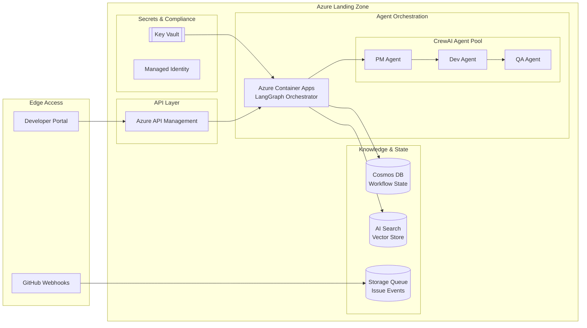

# Hour 4 Teaching Guide: Azure Deployment and Best Practices

**Goal:** Students deploy the agent pipeline to Azure and understand production best practices for enterprise AI agents.

**Time:** 60 minutes

---

## Opening (3 minutes)

**What We're Doing This Hour:**

1. Review Azure architecture for AI agents
2. Deploy to Azure Container Apps
3. Configure Azure API Management (APIM)
4. Set up Azure Cosmos DB for state persistence
5. Integrate Azure AI Search (production RAG)
6. Review enterprise best practices from research

**Key Message:** "Local development is great for learning. Production requires Azure services that scale, secure, and observe."

---

## Azure Architecture Overview (10 minutes)

### The Production Architecture

**Show the Mermaid diagram:**



### Component Breakdown

| Component | Purpose | Why Azure? |
| --- | --- | --- |
| **Container Apps** | Runs the pipeline | Serverless containers, auto-scale |
| **API Management** | Gateway, rate limiting | Enterprise security, analytics |
| **Cosmos DB** | Workflow state, results | Global distribution, low latency |
| **AI Search** | Vector store (RAG) | Enterprise search, hybrid queries |
| **Key Vault** | API keys, secrets | Managed secrets, rotation |
| **Storage Queue** | Async processing | Decouple webhook from pipeline |

**Say:** "This is the same pipeline we built locally, but with Azure services handling scale, state, and security."

---

## Deploy to Azure Container Apps (15 minutes)

### Prerequisites

**Verify Azure CLI:**

```bash
az --version
az login
az account show
```

**Set variables:**

```bash
RESOURCE_GROUP="rg-agent-mvp"
LOCATION="eastus"
CONTAINER_APP_ENV="cae-agent-mvp"
CONTAINER_APP="ca-agent-pipeline"
ACR_NAME="acragentmvp"
```

### Step 1: Create Resource Group (2 minutes)

```bash
az group create \
  --name $RESOURCE_GROUP \
  --location $LOCATION
```

### Step 2: Create Container Registry (3 minutes)

```bash
# Create registry
az acr create \
  --resource-group $RESOURCE_GROUP \
  --name $ACR_NAME \
  --sku Basic \
  --admin-enabled true

# Get credentials
ACR_PASSWORD=$(az acr credential show \
  --name $ACR_NAME \
  --query "passwords[0].value" -o tsv)
```

### Step 3: Build and Push Container (5 minutes)

**Create Dockerfile (if not exists):**

```dockerfile
# Dockerfile
FROM python:3.11-slim

WORKDIR /app

# Install dependencies
COPY requirements.txt .
RUN pip install --no-cache-dir -r requirements.txt

# Copy source
COPY src/ ./src/
COPY pyproject.toml .

# Install package
RUN pip install -e .

# Expose port for health checks
EXPOSE 8080

# Run the MCP server (or pipeline as HTTP endpoint)
CMD ["python", "-m", "agent_mvp.mcp_server", "--port", "8080"]
```

**Build and push:**

```bash
# Login to ACR
az acr login --name $ACR_NAME

# Build and push
az acr build \
  --registry $ACR_NAME \
  --image agent-pipeline:v1 \
  --file Dockerfile \
  .
```

### Step 4: Deploy Container App (5 minutes)

**Create environment:**

```bash
az containerapp env create \
  --name $CONTAINER_APP_ENV \
  --resource-group $RESOURCE_GROUP \
  --location $LOCATION
```

**Deploy app:**

```bash
az containerapp create \
  --name $CONTAINER_APP \
  --resource-group $RESOURCE_GROUP \
  --environment $CONTAINER_APP_ENV \
  --image $ACR_NAME.azurecr.io/agent-pipeline:v1 \
  --registry-server $ACR_NAME.azurecr.io \
  --registry-username $ACR_NAME \
  --registry-password $ACR_PASSWORD \
  --target-port 8080 \
  --ingress external \
  --cpu 1 \
  --memory 2Gi \
  --min-replicas 0 \
  --max-replicas 5 \
  --secrets "anthropic-key=<YOUR_KEY>" \
  --env-vars "ANTHROPIC_API_KEY=secretref:anthropic-key"
```

**Get the URL:**

```bash
az containerapp show \
  --name $CONTAINER_APP \
  --resource-group $RESOURCE_GROUP \
  --query properties.configuration.ingress.fqdn -o tsv
```

---

## Configure API Management (10 minutes)

### Why APIM?

- **Rate limiting:** Prevent abuse
- **Authentication:** API keys, OAuth
- **Caching:** Reduce LLM calls
- **Analytics:** Track usage, costs
- **Transformation:** Request/response manipulation

### Create APIM Instance (3 minutes)

```bash
APIM_NAME="apim-agent-mvp"

az apim create \
  --name $APIM_NAME \
  --resource-group $RESOURCE_GROUP \
  --publisher-name "O'Reilly" \
  --publisher-email "admin@example.com" \
  --sku-name Consumption
```

**Note:** Consumption tier takes ~5 minutes to deploy.

### Import API from Container App (3 minutes)

**In Azure Portal:**

1. Open API Management → APIs
2. Add API → Container App
3. Select your Container App
4. Configure base URL and operations

**Or via CLI:**

```bash
CONTAINER_URL=$(az containerapp show \
  --name $CONTAINER_APP \
  --resource-group $RESOURCE_GROUP \
  --query properties.configuration.ingress.fqdn -o tsv)

az apim api create \
  --resource-group $RESOURCE_GROUP \
  --service-name $APIM_NAME \
  --api-id agent-pipeline \
  --path /pipeline \
  --display-name "Agent Pipeline API" \
  --service-url "https://$CONTAINER_URL"
```

### Add Rate Limiting Policy (4 minutes)

**In Portal → API → Inbound policies:**

```xml
<policies>
    <inbound>
        <base />
        <rate-limit calls="10" renewal-period="60" />
        <quota calls="100" renewal-period="86400" />
        <set-header name="X-Request-ID" exists-action="skip">
            <value>@(context.RequestId.ToString())</value>
        </set-header>
    </inbound>
    <backend>
        <base />
    </backend>
    <outbound>
        <base />
    </outbound>
</policies>
```

**Explain:**

- `rate-limit`: 10 calls per minute per subscription
- `quota`: 100 calls per day
- `X-Request-ID`: Track requests for debugging

---

## Set Up Cosmos DB for State (8 minutes)

### Why Cosmos DB?

- **Workflow state:** Track pipeline runs
- **Results storage:** Query past outputs
- **Multi-region:** Global distribution for low latency
- **Partitioning:** Scale to millions of documents

### Create Cosmos Account (3 minutes)

```bash
COSMOS_ACCOUNT="cosmos-agent-mvp"

az cosmosdb create \
  --name $COSMOS_ACCOUNT \
  --resource-group $RESOURCE_GROUP \
  --kind GlobalDocumentDB \
  --default-consistency-level Session \
  --locations regionName=$LOCATION failoverPriority=0
```

### Create Database and Container (3 minutes)

```bash
# Create database
az cosmosdb sql database create \
  --account-name $COSMOS_ACCOUNT \
  --resource-group $RESOURCE_GROUP \
  --name AgentMVP

# Create container for pipeline runs
az cosmosdb sql container create \
  --account-name $COSMOS_ACCOUNT \
  --resource-group $RESOURCE_GROUP \
  --database-name AgentMVP \
  --name PipelineRuns \
  --partition-key-path /issue_id \
  --throughput 400
```

### Update Pipeline to Use Cosmos (2 minutes)

**Add to environment variables:**

```bash
COSMOS_ENDPOINT=$(az cosmosdb show \
  --name $COSMOS_ACCOUNT \
  --resource-group $RESOURCE_GROUP \
  --query documentEndpoint -o tsv)

COSMOS_KEY=$(az cosmosdb keys list \
  --name $COSMOS_ACCOUNT \
  --resource-group $RESOURCE_GROUP \
  --query primaryMasterKey -o tsv)

# Update Container App
az containerapp update \
  --name $CONTAINER_APP \
  --resource-group $RESOURCE_GROUP \
  --set-env-vars \
    "COSMOS_ENDPOINT=$COSMOS_ENDPOINT" \
    "COSMOS_KEY=secretref:cosmos-key" \
  --secrets "cosmos-key=$COSMOS_KEY"
```

---

## Azure AI Search for Production RAG (7 minutes)

### Why AI Search Instead of ChromaDB?

| Feature | ChromaDB | Azure AI Search |
| --- | --- | --- |
| Deployment | Local/container | Managed service |
| Scale | Single instance | Auto-scale |
| Hybrid search | Vector only | Vector + keyword |
| Filters | Basic | Rich faceting |
| Security | None | RBAC, managed identity |
| Cost | Free | $$$  (but managed) |

**Say:** "ChromaDB is great for dev. AI Search is for production."

### Create AI Search Service (3 minutes)

```bash
SEARCH_NAME="search-agent-mvp"

az search service create \
  --name $SEARCH_NAME \
  --resource-group $RESOURCE_GROUP \
  --sku Basic \
  --partition-count 1 \
  --replica-count 1
```

### Create Issues Index (4 minutes)

**Index schema for issues:**

```json
{
  "name": "issues-index",
  "fields": [
    {"name": "id", "type": "Edm.String", "key": true},
    {"name": "title", "type": "Edm.String", "searchable": true},
    {"name": "body", "type": "Edm.String", "searchable": true},
    {"name": "embedding", "type": "Collection(Edm.Single)", "dimensions": 1536, "vectorSearchProfile": "default"},
    {"name": "pm_summary", "type": "Edm.String", "searchable": true},
    {"name": "qa_verdict", "type": "Edm.String", "filterable": true},
    {"name": "created_at", "type": "Edm.DateTimeOffset", "sortable": true}
  ],
  "vectorSearch": {
    "algorithms": [{"name": "hnsw", "kind": "hnsw"}],
    "profiles": [{"name": "default", "algorithm": "hnsw"}]
  }
}
```

**Create via Portal or REST API:**

```bash
SEARCH_KEY=$(az search admin-key show \
  --service-name $SEARCH_NAME \
  --resource-group $RESOURCE_GROUP \
  --query primaryKey -o tsv)

curl -X POST \
  "https://$SEARCH_NAME.search.windows.net/indexes?api-version=2023-11-01" \
  -H "Content-Type: application/json" \
  -H "api-key: $SEARCH_KEY" \
  -d @index-schema.json
```

---

## Best Practices Review (7 minutes)

### From Enterprise AI Agents Research

**Pull key insights from the research documents:**

### 1. Security First

| Practice | Implementation |
| --- | --- |
| **Secrets in Key Vault** | Never in code or env vars |
| **Managed Identity** | No credentials in container |
| **Network isolation** | VNet for internal services |
| **Prompt injection defense** | Input validation, output filtering |

**Example: Key Vault integration:**

```bash
# Enable managed identity
az containerapp identity assign \
  --name $CONTAINER_APP \
  --resource-group $RESOURCE_GROUP \
  --system-assigned

# Grant Key Vault access
IDENTITY_ID=$(az containerapp identity show \
  --name $CONTAINER_APP \
  --resource-group $RESOURCE_GROUP \
  --query principalId -o tsv)

az keyvault set-policy \
  --name kv-agent-mvp \
  --object-id $IDENTITY_ID \
  --secret-permissions get list
```

### 2. Observability

**Three pillars:**

1. **Logs:** Structured logging to Application Insights
2. **Metrics:** Token usage, latency, error rates
3. **Traces:** Distributed tracing across agents

**Enable Application Insights:**

```bash
az containerapp update \
  --name $CONTAINER_APP \
  --resource-group $RESOURCE_GROUP \
  --dapr-enabled true \
  --dapr-app-id agent-pipeline \
  --dapr-app-port 8080
```

### 3. Cost Management

**Cost levers:**

| Lever | Strategy |
| --- | --- |
| **Model selection** | Haiku for simple, Sonnet for complex |
| **Caching** | Cache prompts and responses |
| **Batching** | Process multiple issues together |
| **Circuit breakers** | Stop runaway costs |

**Example: Model routing:**

```python
def get_model_for_task(task_complexity: str) -> str:
    if task_complexity == "low":
        return "claude-3-haiku-20240307"  # $0.25/1M tokens
    elif task_complexity == "medium":
        return "claude-3-5-sonnet-20241022"  # $3/1M tokens
    else:
        return "claude-3-opus-20240229"  # $15/1M tokens
```

### 4. Testing AI Systems

**Testing pyramid for agents:**

```
           /\
          /  \
         / E2E \      ← Full pipeline tests (few)
        /--------\
       /Integration\   ← Agent interaction tests (some)
      /--------------\
     /  Unit Tests    \ ← Prompt validation, schemas (many)
    /------------------\
```

**Key test types:**

- **Golden dataset:** Known inputs with expected outputs
- **Property tests:** "QA always returns a verdict"
- **Regression tests:** Previous issues still work
- **Human eval:** Sample and review manually

### 5. Guardrails and Safety

**Implement defense in depth:**

1. **Input validation:** Schema validation, content filtering
2. **Output validation:** JSON schema, harmful content detection
3. **Tool restrictions:** Limit what agents can access
4. **Human-in-the-loop:** Escalation for uncertain decisions

---

## Wrap-Up and Q&A (5 minutes)

### What We Accomplished in 4 Hours

| Hour | Topic | Key Skills |
| --- | --- | --- |
| 1 | What is an Agent? | Claude Code, Copilot Studio |
| 2 | Run, Test, Debug | Pipeline execution, VSCode debugging |
| 3 | MCP and RAG | Server configuration, vibe coding |
| 4 | Azure Deployment | Container Apps, APIM, Cosmos, AI Search |

### Architecture Comparison

**Local (Hours 1-3):**

```
File System → Pipeline → JSON Files
```

**Production (Hour 4):**

```
APIM → Container Apps → Cosmos DB
        ↓
    AI Search (RAG)
        ↓
    Key Vault (Secrets)
```

### Next Steps for Students

**Beginner:**

- Deploy the basic Container App
- Add one APIM policy (rate limiting)
- View logs in Application Insights

**Intermediate:**

- Add Cosmos DB persistence
- Implement model routing by complexity
- Set up GitHub webhook integration

**Advanced:**

- Full AI Search integration
- Custom evaluations pipeline
- Multi-region deployment

### Resources

**Azure Documentation:**

- [Container Apps](https://learn.microsoft.com/azure/container-apps/)
- [API Management](https://learn.microsoft.com/azure/api-management/)
- [Cosmos DB](https://learn.microsoft.com/azure/cosmos-db/)
- [AI Search](https://learn.microsoft.com/azure/search/)

**Enterprise AI Agents:**

- ChatGPT Research: Enterprise AI Agents 2026
- Gemini Research: Architecture of Autonomy
- Claude Research: Production Patterns

---

## Teaching Tips

### If Azure Deployment Is Slow

**Prep ahead:**

- Pre-create APIM (takes 20+ minutes on Developer tier)
- Use Consumption tier for faster deployment
- Have screenshots ready for each step

### If Students Don't Have Azure Access

**Options:**

1. Demo on your screen while they follow along
2. Use Azure free tier ($200 credit)
3. Show architecture diagrams, skip deployment
4. Focus on best practices discussion

### If Running Behind

**Prioritize:**

1. Container Apps deployment (core)
2. Best practices review (critical concepts)
3. Skip APIM and Cosmos (can do later)

### If Students Are Advanced

**Challenges:**

1. "Add a custom domain and TLS to your Container App"
2. "Implement blue-green deployment with traffic splitting"
3. "Create a Bicep template for the entire architecture"

---

## Quick Reference: Azure CLI Commands

**Deploy Container App:**
```bash
az containerapp create \
  --name $CONTAINER_APP \
  --resource-group $RESOURCE_GROUP \
  --environment $CONTAINER_APP_ENV \
  --image $ACR_NAME.azurecr.io/agent-pipeline:v1 \
  --target-port 8080 \
  --ingress external
```

**Get Container App URL:**
```bash
az containerapp show \
  --name $CONTAINER_APP \
  --resource-group $RESOURCE_GROUP \
  --query properties.configuration.ingress.fqdn -o tsv
```

**View logs:**
```bash
az containerapp logs show \
  --name $CONTAINER_APP \
  --resource-group $RESOURCE_GROUP \
  --follow
```

**Scale Container App:**
```bash
az containerapp update \
  --name $CONTAINER_APP \
  --resource-group $RESOURCE_GROUP \
  --min-replicas 1 \
  --max-replicas 10
```

---

## Final Checklist

Before ending the session, verify students can:

- [ ] Explain the Azure architecture for AI agents
- [ ] Deploy a container to Azure Container Apps
- [ ] Understand APIM's role in production
- [ ] Describe when to use Cosmos vs AI Search
- [ ] List 3 security best practices
- [ ] Identify cost optimization strategies
- [ ] Access resources for continued learning

---

**Congratulations! You've taught production AI agents in 4 hours.**
