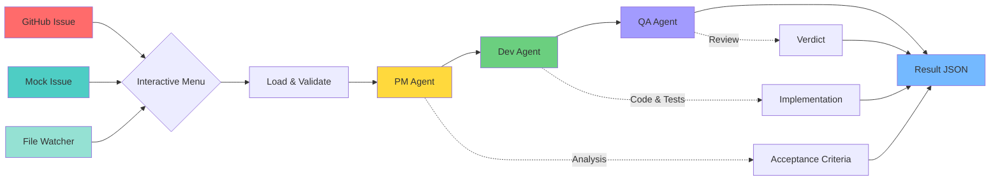
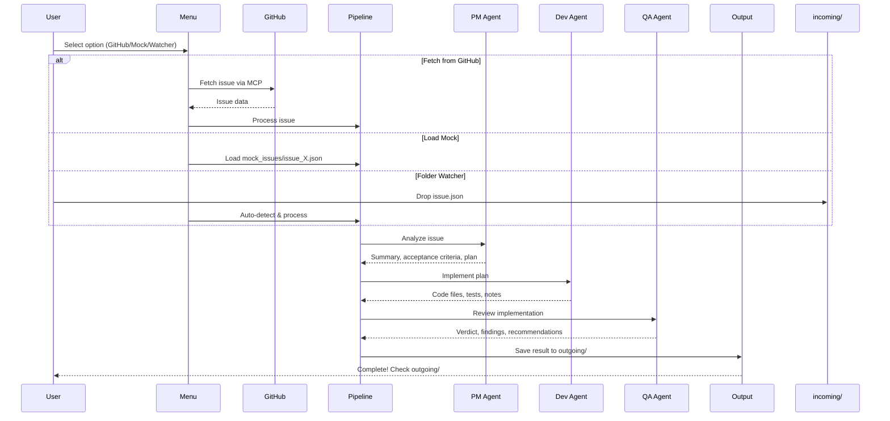

# O'Reilly AI Agents MVP

**Issue Triage + Implementation Draft Pipeline**

A production-ready demonstration of AI agent orchestration using:
- **LangGraph** for stateful orchestration
- **CrewAI** for multi-agent role definitions (PM, Dev, QA)
- **MCP (Model Context Protocol)** server for tools/resources/prompts and GitHub issue fetching
- **SQLite persistence** for pipeline results and run metadata
- **Token tracking & cost awareness** for teaching responsible AI usage

> **Note:** This demo teaches orchestration and agent roles. It is not competing with GitHub Copilot's coding agent or similar tools. The focus is on understanding the patterns and architecture.

---

## Pipeline Flow



Results are written to `outgoing/` and persisted in `data/pipeline.db` (SQLite).

---

## Quickstart

### 1. Clone and Setup

```bash
# Clone the repository
git clone https://github.com/timothywarner-org/agents2.git
cd agents2/oreilly-agent-mvp

# Run setup script (creates venv, installs dependencies)
./scripts/setup.sh      # Git Bash / Linux / macOS
# OR
.\scripts\setup.ps1     # PowerShell
```

### 2. Configure Environment

Copy `.env.example` to `.env` and configure your LLM provider:

```bash
cp .env.example .env
```

**Required:** Set at least one LLM provider:

| Provider | Required Variables |
|----------|-------------------|
| **Anthropic** | `LLM_PROVIDER=anthropic`, `ANTHROPIC_API_KEY=sk-ant-...` |
| **OpenAI** | `LLM_PROVIDER=openai`, `OPENAI_API_KEY=sk-...` |
| **DeepSeek** | `LLM_PROVIDER=openai`, `OPENAI_API_KEY=sk-...`, `OPENAI_BASE_URL=https://api.deepseek.com`, `LLM_MODEL=deepseek-chat` |
| **Azure OpenAI** | `LLM_PROVIDER=azure`, `AZURE_OPENAI_API_KEY`, `AZURE_OPENAI_ENDPOINT`, `AZURE_OPENAI_DEPLOYMENT` |

**Optional:** For GitHub integration:
- `GITHUB_TOKEN` - Get from [GitHub Settings > Developer settings > Personal access tokens](https://github.com/settings/tokens)

### 3. Run the Interactive Menu (Recommended)

**Option A: Quick Launch (PowerShell 7)** ⚡
```powershell
.\launch.ps1  # Beautiful menu with all options
```

**Option B: Direct command**
```bash
# Start the interactive menu
agent-menu
# OR
./scripts/run_menu.sh      # Git Bash
# OR
.\scripts\run_menu.ps1     # PowerShell
```

**Menu options:**
1. **Fetch issue from GitHub** → Enter repo and issue number (uses REST API with PAT)
2. **Load a mock issue** → Select from pre-made samples
3. **Start folder watcher** → Auto-process files dropped in `incoming/`
4. **Start MCP server** → Expose tools via stdio (Claude/VS Code)
5. **Start MCP Inspector** → Web UI for testing tools (requires Node.js)
q. **Quit**

### 4. Alternative: Run Directly

```bash
# Process a mock issue
python -m agent_mvp.pipeline.run_once --source mock --mock-file mock_issues/issue_001.json

# Process from a file
python -m agent_mvp.pipeline.run_once --source file --file incoming/my_issue.json

# Fetch from GitHub and process
python -m agent_mvp.pipeline.run_once --source github --repo owner/repo --issue 123

# Write dev files to disk (in addition to result JSON)
python -m agent_mvp.pipeline.run_once --source mock --mock-file mock_issues/issue_001.json --write-files

# Start MCP server (for Claude Desktop, VS Code Copilot)
agent-mcp
# OR
python -m agent_mvp.mcp_server
```

---

## Project Structure

```
oreilly-agent-mvp/
├── README.md                       # You are here
├── pyproject.toml                  # Dependencies, scripts, build config
├── .env                            # Your secrets (API keys) - DO NOT COMMIT
├── .env.example                    # Template for .env
├── .gitignore                      # Git exclusions
│
├── launch.ps1                      # 🚀 PowerShell 7 quick launcher (main menu)
├── mcp.ps1                         # 🚀 PowerShell 7 MCP server launcher
├── inspector.ps1                   # 🚀 PowerShell 7 MCP Inspector launcher
│
├── .mcp/
│   └── claude_desktop_config.json  # Claude Desktop MCP config (local server)
│
├── .vscode/
│   ├── mcp.json                    # VS Code MCP config (GitHub + local server)
│   └── settings.json               # Recommended VS Code settings
│
├── src/agent_mvp/                  # Core application logic
│   ├── __init__.py                 # Package metadata
│   ├── config.py                   # Config management (LLM provider, env vars)
│   ├── models.py                   # Pydantic data models (Issue, PMOutput, etc.)
│   ├── logging_setup.py            # Structured logging with rich output
│   │
│   ├── cli/                        # Interactive command-line interface
│   │   ├── __init__.py
│   │   └── interactive_menu.py     # Main menu: GitHub/Mock/Watcher/Quit
│   │
│   ├── integrations/               # External service connectors
│   │   ├── __init__.py
│   │   └── github_issue_fetcher.py # Fetch issues via GitHub REST API
│   │
│   ├── issue_sources/              # Issue loading strategies
│   │   ├── __init__.py
│   │   ├── file_issue_source.py    # Load from JSON file
│   │   └── mock_issue_source.py    # Load from mock_issues/
│   │
│   ├── mcp_server/                 # Model Context Protocol server
│   │   ├── __init__.py
│   │   ├── server.py               # FastMCP server with tools/resources/prompts
│   │   └── README.md               # MCP server documentation
│   │
│   ├── pipeline/                   # Agent orchestration
│   │   ├── __init__.py
│   │   ├── graph.py                # LangGraph state machine (PM→Dev→QA)
│   │   ├── crew.py                 # CrewAI agent definitions
│   │   ├── prompts.py              # System prompts for each agent
│   │   └── run_once.py             # CLI entry point for single runs
│   │
│   ├── watcher/                    # Folder monitoring
│   │   ├── __init__.py
│   │   └── folder_watcher.py       # Auto-process incoming/ files
│   │
│   └── util/                       # Utilities
│       ├── __init__.py
│       └── fs.py                   # File system helpers
│
├── scripts/                        # Shell scripts
│   ├── setup.sh                    # Setup (Bash) - creates venv, installs deps
│   ├── setup.ps1                   # Setup (PowerShell)
│   ├── run_menu.sh                 # Launch interactive menu (Bash)
│   ├── run_menu.ps1                # Launch interactive menu (PowerShell)
│   ├── run_once.sh                 # Run pipeline once (Bash)
│   ├── run_once.ps1                # Run pipeline once (PowerShell)
│   ├── run_watcher.sh              # Start folder watcher (Bash)
│   ├── run_watcher.ps1             # Start folder watcher (PowerShell)
│   ├── run_mcp.sh                  # Start MCP server (Bash)
│   ├── run_mcp.ps1                 # Start MCP server (PowerShell)
│   ├── run_mcp_inspector.sh        # Start with MCP Inspector - web UI (Bash)
│   └── run_mcp_inspector.ps1       # Start with MCP Inspector - web UI (PowerShell)
│
├── mock_issues/                    # Sample issues for testing
│   ├── issue_001.json              # #101 CLI: validate issue JSON files
│   ├── issue_002.json              # #102 MCP: list_mock_issues priority from labels
│   ├── issue_003.json              # #103 Watcher: avoid partially-written files
│   ├── issue_004.json              # #104 Token tracking: handle missing usage
│   ├── issue_005.json              # #105 Schema: allow optional issue metadata
│   └── issue_006.json              # #106 Pipeline: dry-run + output-dir consistency
│
├── incoming/                       # Drop issues here for watcher
├── outgoing/                       # Pipeline results saved here
│
└── tests/                          # Test suite
    ├── __init__.py
    ├── test_fs_moves.py            # File watching and move semantics
    ├── test_mcp_server.py          # MCP registration contract tests
    ├── test_schema.py              # Pydantic model validation
    └── test_token_tracking.py      # Token usage aggregation logic
```

---

## How It Works

### Agent Workflow



### Agent Responsibilities

| Agent | Role | Input | Output |
|-------|------|-------|--------|
| **PM Agent** | Product Manager | Raw issue | Summary, acceptance criteria, implementation plan, assumptions |
| **Dev Agent** | Senior Developer | Issue + PM plan | Code files, tests, implementation notes |
| **QA Agent** | QA Engineer | Issue + PM plan + Dev code | Verdict (pass/fail/needs-human), findings, test recommendations |

### Three Ways to Run

1. **Interactive Menu** (Recommended): `agent-menu` - Choose GitHub, mock, or watcher
2. **Direct CLI**: `python -m agent_mvp.pipeline.run_once` - Process a specific issue
3. **Watcher Mode**: `agent-watcher` - Auto-process files dropped in `incoming/`

---

## Quick Launchers (PowerShell 7)

For the easiest experience on Windows, use these one-command launchers:

**Main launcher with menu:**
```powershell
.\launch.ps1
```
Choose from:
- Interactive menu
- Run pipeline once
- Folder watcher
- MCP server
- MCP Inspector
- Run tests

**Direct launchers:**
```powershell
.\mcp.ps1        # Start MCP server
.\inspector.ps1  # Start MCP Inspector (web UI)
```

---

## Model Context Protocol (MCP) Server

The O'Reilly Agent MVP includes a built-in **MCP server** that exposes the agent pipeline as standardized tools, resources, and prompts. This enables integration with Claude Desktop, VS Code Copilot, and other MCP-compatible clients.

### What's Exposed

**Tools** (Actions LLMs can call):
- `fetch_github_issue` - Fetch issues from GitHub
- `list_mock_issues` - List available test issues
- `load_mock_issue` - Load a specific mock issue
- `run_agent_pipeline` - Run PM → Dev → QA pipeline
- `process_issue_file` - Process issue from file

**Resources** (Data LLMs can read):
- `config://settings` - Application configuration
- `issues://mock/{filename}` - Mock issue content
- `pipeline://schema` - Pydantic schemas
- `pipeline://architecture` - Pipeline documentation

**Prompts** (Reusable templates):
- `analyze_github_issue` - Issue analysis prompt
- `review_implementation_plan` - QA review prompt
- `generate_test_issue` - Test data generation prompt

### Quick Start

1. **Install MCP dependency:**
   ```bash
   pip install mcp>=1.0.0
   ```

2. **Test with MCP Inspector** (recommended):
   ```bash
   ./scripts/run_mcp_inspector.sh  # Requires Node.js
   # Opens web UI for testing tools interactively
   ```

3. **Or start the server directly:**
   ```bash
   agent-mcp
   # OR
   ./scripts/run_mcp.sh  # Git Bash
   ```

3. **Integrate with Claude Desktop:**
   - Copy `.mcp/claude_desktop_config.json` settings to your Claude config
   - Restart Claude Desktop
   - Look for 🔌 icon - you're connected!

4. **Use in VS Code:**
   - Config already in `.vscode/mcp.json`
   - Reload VS Code window
   - Ask Copilot: "Fetch issue #123" or "List mock issues"

### Example Usage

```
You: Fetch issue #42 from timothywarner-org/agents2

Claude: [Uses fetch_github_issue tool]
Issue fetched: "Watcher: avoid processing partially-written incoming JSON files"

You: Run the agent pipeline on it

Claude: [Uses run_agent_pipeline tool]
Pipeline complete!
- PM: Summary + acceptance criteria
- Dev: Proposed code + tests
- QA: pass/fail/needs-human verdict with findings
```

**📖 Full Documentation:** [src/agent_mvp/mcp_server/README.md](src/agent_mvp/mcp_server/README.md)

---

## GitHub Integration

This app can fetch issues from GitHub using either:

1. **REST API** (default) - Uses `requests` library with Personal Access Token
2. **MCP Server** (optional) - Exposes GitHub tools via Model Context Protocol

### REST API Setup

1. Get a GitHub token: [github.com/settings/tokens](https://github.com/settings/tokens)
2. Add to `.env`: `GITHUB_TOKEN=ghp_your_token_here`
3. Run: Interactive menu → Option 1, or use CLI with `--source github`

### Permissions Required

- `repo` scope (read access to repositories)

### MCP vs REST API

| Feature | REST API | MCP Server |
|---------|----------|------------|
| Setup | Simple (just token) | Requires MCP SDK |
| Use in scripts | ✅ Direct calls | ❌ Needs MCP client |
| Use in Claude | ❌ No integration | ✅ Native tools |
| Use in VS Code | ❌ No integration | ✅ Copilot chat |

---

**`.vscode/mcp.json`** (VS Code Copilot Chat):
```json
{
  "servers": {
    "github": {
      "type": "remote",
      "url": "https://api.githubcopilot.com/mcp/",
      "description": "GitHub MCP server for issue and repository operations"
    },
    "oreilly-agent-mvp": {
      "type": "stdio",
      "command": "python",
      "args": ["-m", "agent_mvp.mcp_server"],
      "env": {
        "PYTHONPATH": "${workspaceFolder}/src"
      }
    }
  }
}
```

---

## Issue JSON Schema

Issues processed by the pipeline must follow this format:

```json
{
  "issue_id": "owner/repo#123",
  "repo": "owner/repo",
  "issue_number": 123,
  "title": "Add dark mode support",
  "body": "Users want a dark theme option...",
  "labels": ["feature", "ui"],
  "url": "https://github.com/owner/repo/issues/123",
  "source": "github-mcp"
}
```

**Required fields:** `issue_id`, `repo`, `issue_number`, `title`, `url`

**Source values:** `mock`, `github-mcp`, `manual`

---

## SQLite Persistence

Each pipeline run writes a full JSON result to `outgoing/` and also persists
run metadata plus the full result payload to a local SQLite database.

- Database path: `data/pipeline.db` (auto-created on first run)
- Tables: `pipeline_runs` (metadata) and `pipeline_results` (full JSON)
- Storage code: `src/agent_mvp/persistence/sqlite_store.py`

Example query:
```bash
sqlite3 data/pipeline.db "SELECT run_id, issue_id, verdict FROM pipeline_runs ORDER BY completed_at DESC LIMIT 5;"
```

## Configuration

### Environment Variables

| Variable | Description | Example |
|----------|-------------|---------|
| `LLM_PROVIDER` | LLM provider to use | `anthropic`, `openai`, `azure` |
| `LLM_MODEL` | Model name | `claude-sonnet-4-20250514`, `gpt-4o`, `deepseek-chat` |
| `LLM_TEMPERATURE` | Generation temperature | `0.2` |
| `ANTHROPIC_API_KEY` | Anthropic API key | `sk-ant-...` |
| `OPENAI_API_KEY` | OpenAI API key | `sk-...` |
| `OPENAI_BASE_URL` | Custom base URL (for DeepSeek, etc.) | `https://api.deepseek.com` |
| `AZURE_OPENAI_API_KEY` | Azure OpenAI key | |
| `AZURE_OPENAI_ENDPOINT` | Azure OpenAI endpoint | `https://xxx.openai.azure.com` |
| `AZURE_OPENAI_DEPLOYMENT` | Azure deployment name | |
| `GITHUB_TOKEN` | GitHub Personal Access Token | `ghp_...` |
| `LOG_LEVEL` | Logging level | `DEBUG`, `INFO`, `WARNING`, `ERROR` |

### Using DeepSeek

DeepSeek uses an OpenAI-compatible API:

```env
LLM_PROVIDER=openai
OPENAI_API_KEY=sk-your-deepseek-key
OPENAI_BASE_URL=https://api.deepseek.com
LLM_MODEL=deepseek-chat
LLM_TEMPERATURE=0.2
```

---

## Available Commands

| Command | Description | Example |
|---------|-------------|---------|
| `agent-menu` | Interactive menu (recommended) | `agent-menu` |
| `agent-watcher` | Start folder watcher | `agent-watcher` |
| `python -m agent_mvp.pipeline.run_once` | Process a single issue | See examples below |

### run_once Examples

```bash
# Process a mock issue
python -m agent_mvp.pipeline.run_once --source mock --mock-file mock_issues/issue_001.json

# Process from a file
python -m agent_mvp.pipeline.run_once --source file --file incoming/my_issue.json

# Fetch from GitHub via REST API
python -m agent_mvp.pipeline.run_once --source github --repo timothywarner-org/agents2 --issue 1

# Write generated files to disk
python -m agent_mvp.pipeline.run_once --source mock --mock-file mock_issues/issue_001.json --write-files

# Custom output directory
python -m agent_mvp.pipeline.run_once --source mock --mock-file mock_issues/issue_001.json --output-dir results/

# Debug logging
python -m agent_mvp.pipeline.run_once --source mock --mock-file mock_issues/issue_001.json --log-level DEBUG
```

---

## Running Tests

```bash
# Activate venv
source .venv/Scripts/activate  # Git Bash
# OR
.\.venv\Scripts\Activate.ps1   # PowerShell

# Run all tests
pytest

# Run with coverage report
pytest --cov=agent_mvp

# Run specific test file
pytest tests/test_schema.py

# Verbose output
pytest -v
```

---

## Architecture Decisions

### Why LangGraph?

- **Explicit state management**: TypedDict state passed through nodes
- **Deterministic flow**: Clear PM → Dev → QA → Result path
- **Production-ready**: Built-in checkpointing, error handling
- **Debuggable**: Easy to visualize and trace execution

### Why CrewAI?

- **High-level abstractions**: Focus on agent roles, not plumbing
- **Rapid prototyping**: Define agents with role/goal/backstory
- **Familiar metaphor**: PM/Dev/QA roles everyone understands
- **Extensible**: Can add tools, memory, callbacks

### Why Both?

- **Teaching comparison**: Show two major orchestration paradigms
- **Trade-offs visible**: Explicit control vs. rapid development
- **Real-world decision**: Students learn when to use each

### Why MCP for GitHub?

- **Standard protocol**: Same protocol used by Claude Code, VS Code, Cursor
- **Official server**: `@modelcontextprotocol/server-github` is Anthropic-maintained
- **No REST boilerplate**: MCP handles auth, pagination, rate limiting
- **Portable**: Same integration works across MCP-enabled tools

---

## Troubleshooting

### "API key not set" errors

- Check that `.env` file exists (copy from `.env.example` if needed)
- Verify your API key is set correctly
- Ensure `LLM_PROVIDER` matches your key type

### "Model not found" errors

Check `LLM_MODEL` matches your provider:
- **Anthropic**: `claude-sonnet-4-20250514`, `claude-3-5-haiku-20241022`
- **OpenAI**: `gpt-4o`, `gpt-4o-mini`
- **DeepSeek**: `deepseek-chat`
- **Azure**: Use your deployment name

### GitHub MCP integration fails

- Verify `GITHUB_TOKEN` is set in `.env`
- Check token has `repo` scope
- Ensure Node.js is installed (for npx)
- Test token: `curl -H "Authorization: Bearer $GITHUB_TOKEN" https://api.github.com/user`

### Environment variables not loading correctly

The app uses `load_dotenv(override=True)` to ensure `.env` values take precedence over system environment variables. If you're still having issues:
- Restart your terminal/shell
- Check for conflicting system environment variables
- Verify `.env` file encoding (should be UTF-8)

### Watcher not picking up files

- Ensure files are valid JSON (use `jq` to validate: `jq . < file.json`)
- Check file permissions (should be readable)
- Try manual run first: `python -m agent_mvp.pipeline.run_once --source file --file incoming/test.json`

### "Command not found: agent-menu"

- Activate venv: `source .venv/Scripts/activate` (Git Bash) or `.venv\Scripts\Activate.ps1` (PowerShell)
- Reinstall package: `pip install -e .`
- Or use direct invocation: `python -m agent_mvp.cli.interactive_menu`

### Import errors

- Activate venv first
- Ensure you're in the `oreilly-agent-mvp/` directory
- Reinstall: `pip install -e ".[dev]"`

---

## Teaching Use Cases

This app demonstrates key AI agent patterns:

### 1. Sequential Agent Orchestration
- PM → Dev → QA flow shows staged reasoning
- Each agent has clear inputs/outputs
- State management via LangGraph

### 2. Multi-Framework Comparison
- **LangGraph** (`pipeline/graph.py`): Explicit state machine, production-grade
- **CrewAI** (`pipeline/crew.py`): High-level abstractions, rapid prototyping

### 3. Event-Driven Architecture
- Folder watcher as lightweight event bus
- No queue infrastructure needed for demos
- Easy to understand async processing

### 4. Real-World Integration
- GitHub MCP integration (not just mock data)
- Error handling, rate limiting, auth
- Schema validation and transformation

### 5. Production Considerations
- Environment-based configuration
- Structured logging
- Test coverage
- MCP standard compliance

---

## Further Reading

- [DEBUGGING_SIMPLE.md](DEBUGGING_SIMPLE.md) - **Simple debugging guide** (Command Palette instructions, no Fn keys needed!) 🐛✨
- [DEBUGGING.md](DEBUGGING.md) - **Advanced debugging guide** (breakpoints, data flow, step-through)
- [TOKEN_TRACKING.md](TOKEN_TRACKING.md) - **Cost awareness & token tracking guide** 💰
- [LangGraph Documentation](https://langchain-ai.github.io/langgraph/)
- [CrewAI Documentation](https://docs.crewai.com/)
- [Model Context Protocol](https://modelcontextprotocol.io/)
- [VS Code MCP Servers](https://code.visualstudio.com/docs/copilot/chat/mcp-servers)
- [GitHub MCP Server](https://github.com/modelcontextprotocol/servers/tree/main/src/github)

---

## License

MIT License - See LICENSE file for details.

---

*Built for O'Reilly training on AI agents and orchestration patterns.*
